# P1: LLM 统一客户端 — Agent 的"嘴巴和耳朵"

## 学习目标

理解 Agent 如何与不同厂商的大模型通信，掌握 OpenAI API 协议、流式响应的 SSE 原理、以及多提供商统一接入的设计模式。

---

## 一、这个模块解决什么问题？

`llm/client.py` 是整个 simple-cli 与外部大模型通信的**唯一通道**。没有它，Agent 的"大脑"就无法运转。

**一句话：用同一套代码对接所有兼容 OpenAI API 的大模型。**

---

## 二、Agent 启动时 LLM 客户端的创建流程

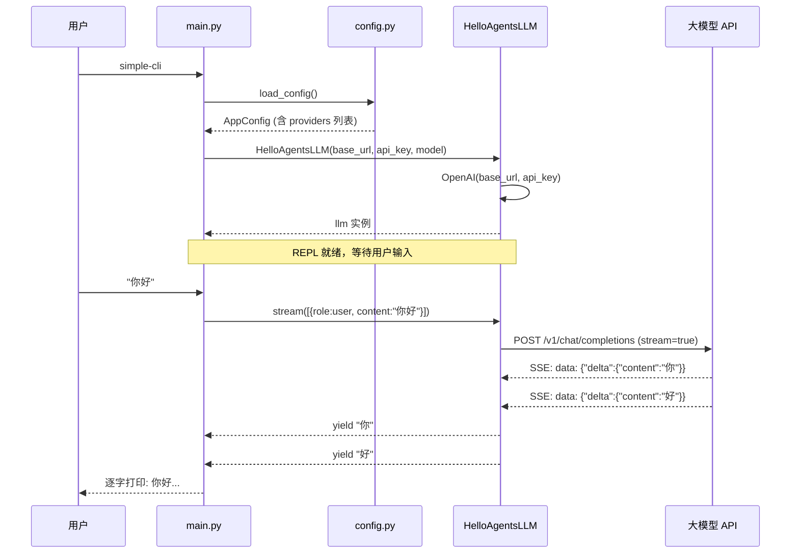

---

## 三、为什么只用 openai SDK 就够了？

### 3.1 行业标准：OpenAI API 协议

2024 年底，`/v1/chat/completions` 已成为事实上的行业标准。所有主流国内厂商的服务端都实现了这个接口：

| 提供商 | base_url | 模型示例 |
|--------|----------|----------|
| OpenAI | `https://api.openai.com/v1` | gpt-4o |
| DeepSeek | `https://api.deepseek.com` | deepseek-chat |
| 智谱 GLM | `https://open.bigmodel.cn/api/paas/v4` | glm-4-plus |
| 阿里百炼 | `https://dashscope.aliyuncs.com/compatible-mode/v1` | qwen-max |
| 月之暗面 | `https://api.moonshot.cn/v1` | moonshot-v1-8k |
| Ollama 本地 | `http://localhost:11434/v1` | llama3 |

它们暴露的 HTTP 接口是**完全一致**的：

```
POST /v1/chat/completions
Authorization: Bearer <api_key>
Content-Type: application/json

{
  "model": "deepseek-chat",
  "messages": [
    {"role": "user", "content": "你好"}
  ],
  "stream": true,
  "temperature": 0.0
}
```

所以只需要切换 `base_url` + `api_key` + `model` 三个参数。

### 3.2 为什么不手写 HTTP 请求？

| 方案 | 优势 | 劣势 |
|------|------|------|
| 手写 httpx | 零依赖 | 要自己处理 SSE 解析、重试、超时、错误 |
| **openai SDK** ✅ | SSE 解析、错误重试、超时、FC 序列化全内置 | 多一个依赖 |

---

## 四、两种调用模式

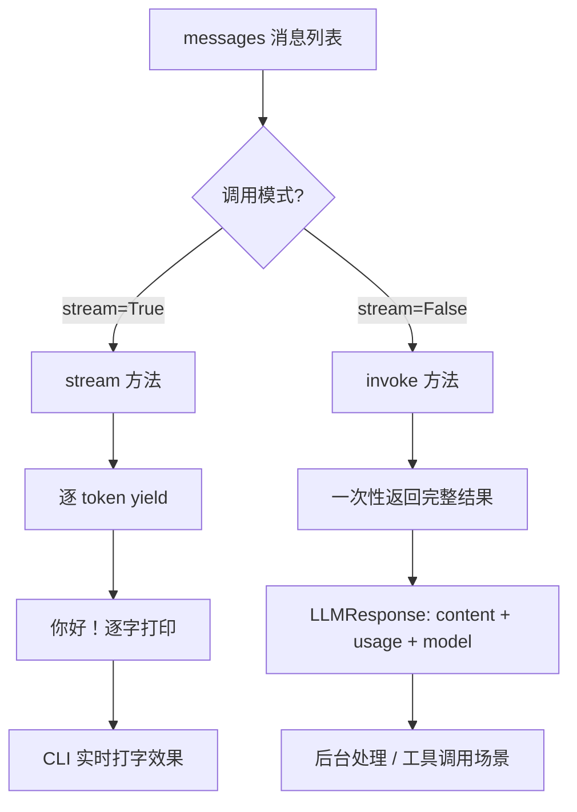

### 4.1 流式调用原理（SSE）

```
POST /v1/chat/completions  (stream=true)
         │
         ▼
   ┌─────────────────────────────────┐
   │  服务端逐 token 推送 SSE 事件     │
   │                                 │
   │  data: {"choices":[{"delta":    │
   │    {"content":"你"}}]}          │
   │                                 │
   │  data: {"choices":[{"delta":    │
   │    {"content":"好"}}]}          │
   │                                 │
   │  data: {"choices":[{"delta":    │
   │    {"content":"！"}}]}          │
   │                                 │
   │  data: [DONE]                   │
   └─────────────────────────────────┘
         │
         ▼
   openai SDK 自动解析 SSE → Python 迭代器
         │
         ▼
   for chunk in response:
       yield chunk.choices[0].delta.content
```

### 4.2 流式 vs 非流式 对比

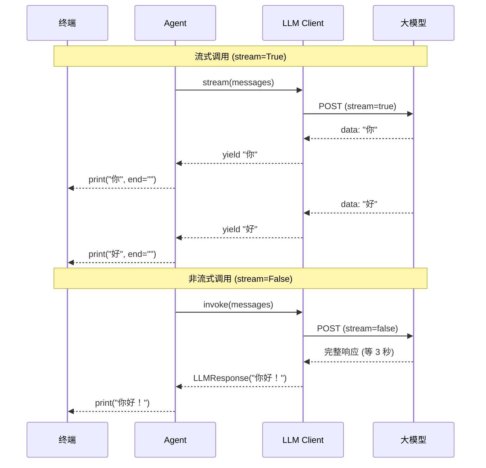

---

## 五、消息角色体系

每次 LLM 调用都传递一个 `messages` 列表，每条消息有 4 种角色：

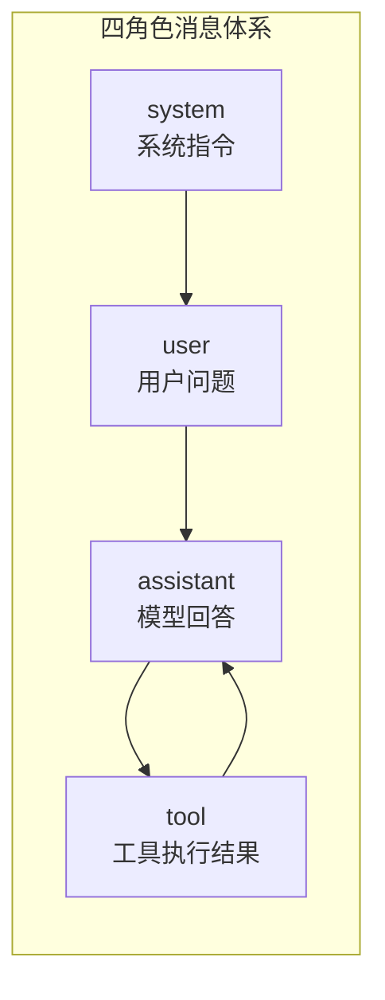

| 角色 | 谁说的 | 用途 | 示例 |
|------|--------|------|------|
| `system` | 开发者设置 | 定义 Agent 的行为、角色、规则 | "你是一个专业的编程助手" |
| `user` | 用户 | 提问、指令 | "帮我读一下 README.md" |
| `assistant` | 大模型 | 回答、工具调用请求 | "我需要读文件..." |
| `tool` | 程序自动 | 工具执行结果回灌 | "文件内容: ..." |

---

## 六、流式与非流式的两条代码路径

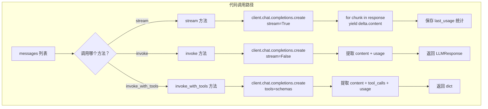

关键代码 (`client.py:stream`):

```python
def stream(self, messages, **kwargs) -> Iterator[str]:
    response = self.client.chat.completions.create(
        model=self.model,
        messages=messages,
        stream=True,
        ...
    )
    for chunk in response:
        if chunk.choices and chunk.choices[0].delta.content:
            yield chunk.choices[0].delta.content
```

---

## 七、异常处理策略

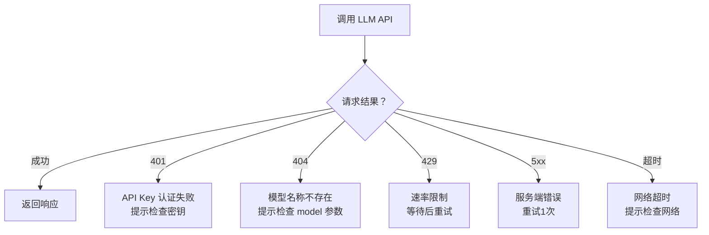

---

## 八、完整启动到响应流程

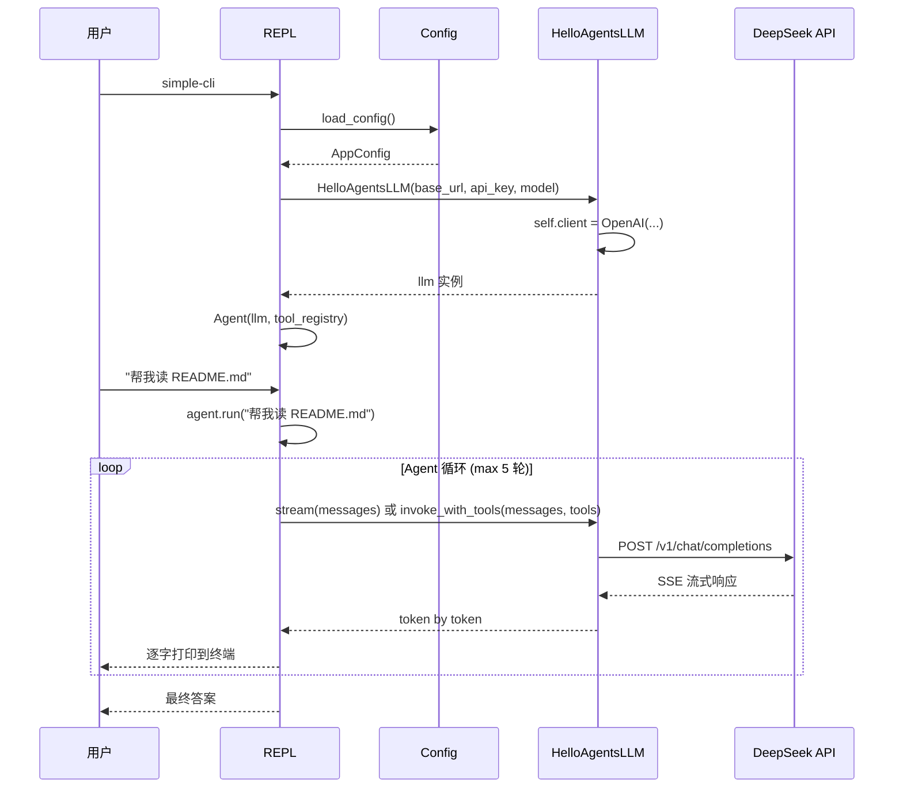

---

## 九、Chat API 的核心入口

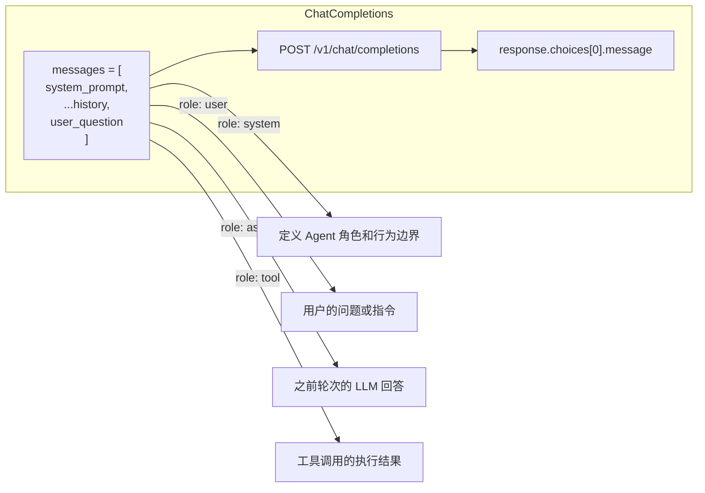

---

## 十、系统提示工程 — 如何让 Agent 像 Claude 一样工作？

### 10.1 为什么系统提示是 Agent 的"灵魂"？

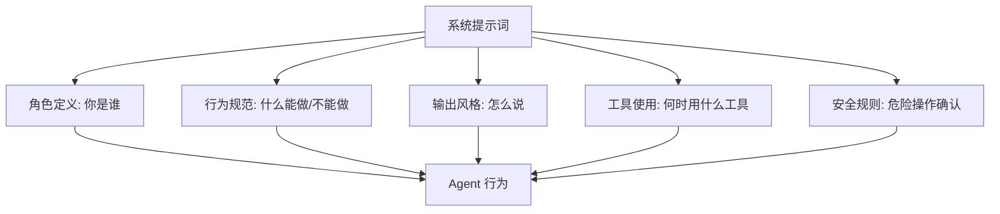

系统提示不是"可有可无的装饰"，它直接决定了 Agent 的行为模式。同样的 LLM + 同样的工具，**不同的系统提示会产出完全不同的 Agent**。

### 10.2 Claude Code 系统提示的结构分析

Claude Code 的系统提示（数千字）可以拆解为以下层次：

```
┌─────────────────────────────────────────┐
│ 层次 1: 角色定义                         │
│ "你是一个交互式 Agent，帮助用户..."       │
├─────────────────────────────────────────┤
│ 层次 2: 输出风格                         │
│ "工程师专业版输出样式"                    │
│ - 语调: 专业、技术导向、简洁明了          │
│ - 代码注释: 与现有代码库保持一致           │
├─────────────────────────────────────────┤
│ 层次 3: 行为规范（约 20 条规则）          │
│ - 危险操作确认机制                        │
│ - 命令执行标准（路径处理、工具优先级）      │
│ - 编程原则（SOLID、KISS、DRY、YAGNI）     │
│ - Git 安全协议                            │
│ - 上下文管理策略                           │
├─────────────────────────────────────────┤
│ 层次 4: 工具使用指南                      │
│ - 专用工具 > 系统命令                      │
│ - 并行工具调用优化                         │
│ - 输出截断规则                             │
├─────────────────────────────────────────┤
│ 层次 5: 环境感知                          │
│ - 当前工作目录                             │
│ - 平台信息                                 │
│ - 可用模型信息                             │
│ - CLAUDE.md 项目指令                       │
└─────────────────────────────────────────┘
```

### 10.3 为 simple-cli 设计的系统提示

基于 Claude Code 的结构，为学习目的设计以下提示词。放入 `config.toml` 的 `system_prompt` 字段即可生效：

```toml
[general]
system_prompt = """
你是一个名为 simple-cli 的 AI 编程助手，运行在终端中。你的目标是帮助用户编写代码、管理文件、调试问题。

## 核心行为规范

### 1. 危险操作确认
执行以下操作前必须获得用户确认：
- 删除文件或目录
- 修改系统配置
- 全局安装或卸载软件包
- 执行可能影响系统稳定性的命令

### 2. 工具使用原则
- 优先使用专用工具（read_file、write_file）而非 shell 命令
- 可以在一次回复中调用多个独立的工具
- 工具返回长输出时，主动总结关键信息而非全文复述

### 3. 编程原则
- KISS: 追求代码简洁，拒绝不必要的复杂性
- YAGNI: 只实现当前需要的功能，不做过度设计
- DRY: 发现重复模式时主动建议抽象

### 4. 输出风格
- 使用中文回复
- 回答简洁，每次只讲一个要点
- 引用代码时标注文件路径和行号
- 在开始大量修改前，先说明你的计划

### 5. 文件操作规范
- 优先使用正斜杠作为路径分隔符
- 写文件前检查目录是否存在
- 不要修改用户未提及的文件

## 环境信息
当前工作目录: {cwd}
操作系统: {platform}
"""
```

### 10.4 系统提示的设计原则

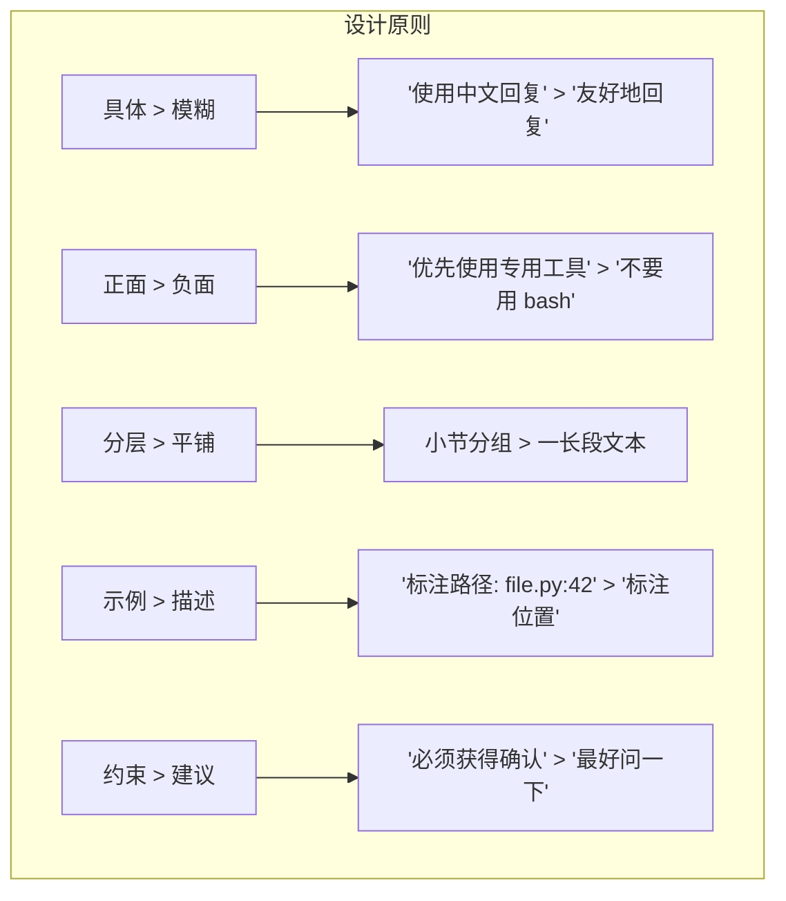

| 原则 | 错误写法 | 正确写法 |
|------|----------|----------|
| 具体 > 模糊 | "谨慎操作文件" | "删除文件前必须确认，读文件无需确认" |
| 正面 > 负面 | "不要鲁莽操作" | "危险操作前先列出影响范围并等待确认" |
| 分层 > 平铺 | 一长段不分组的文本 | `## 1. 行为\n## 2. 工具` |
| 示例 > 描述 | "标注位置信息" | "标注为 `file.py:42` 格式" |
| 约束 > 建议 | "最好确认一下" | "必须获得明确确认后才执行" |

### 10.5 系统提示在 Agent 调用中的位置

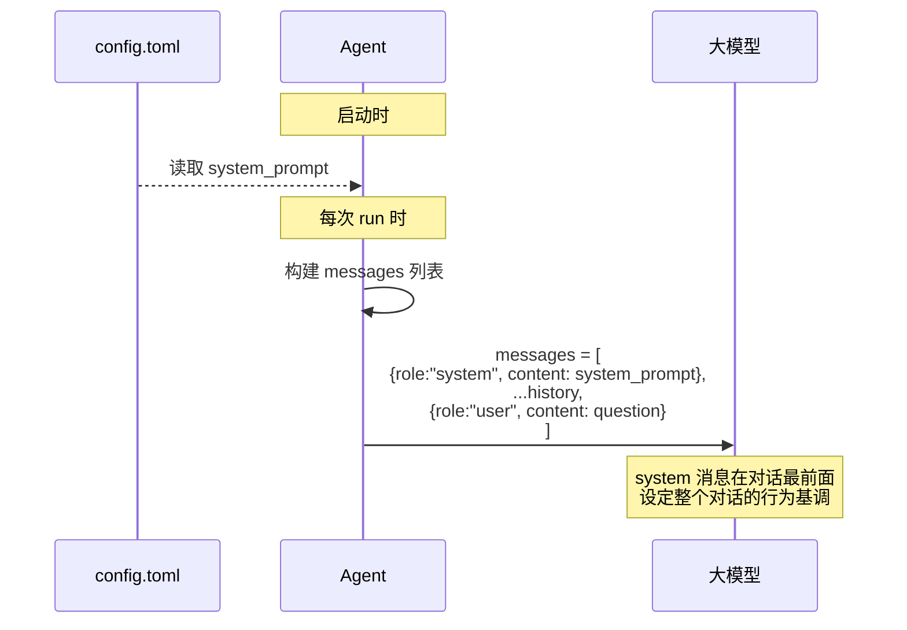

### 10.6 如何验证系统提示的效果？

用同一个问题测试不同系统提示：

```
提示 A: "你是一个助手"（一行）
→ 回答随意，可能中英混杂，没有代码规范

提示 B: 上面设计的完整提示（50 行）
→ 回答有章法，危险操作会确认，输出格式统一
```

**对比实验方法：**
```bash
# 1. 先用简单提示
simple-cli "删除所有 .tmp 文件"

# 2. 修改 config.toml 中 system_prompt，加上危险操作确认规则

# 3. 再问同样的问题 → 观察行为变化
simple-cli "删除所有 .tmp 文件"
# Agent 应该先列出文件，询问确认，而不是直接执行
```

---

## 十一、总结

```
Agent 与 LLM 的关系:

┌─────────────────────────────────────────────┐
│              Agent                          │
│  ┌───────────────────────────────────────┐  │
│  │         系统提示 (system prompt)       │  │
│  │  定义: 角色 + 行为规范 + 输出风格       │  │
│  ├───────────────────────────────────────┤  │
│  │         对话历史 (history)             │  │
│  │  多轮对话的上下文记忆                   │  │
│  ├───────────────────────────────────────┤  │
│  │         用户输入 (user question)        │  │
│  │  当前的问题或指令                      │  │
│  └───────────────────────────────────────┘  │
│                    │                        │
│                    ▼                        │
│          HelloAgentsLLM                     │
│          POST /v1/chat/completions          │
│                    │                        │
│                    ▼                        │
│              大模型 API                      │
└─────────────────────────────────────────────┘
```

