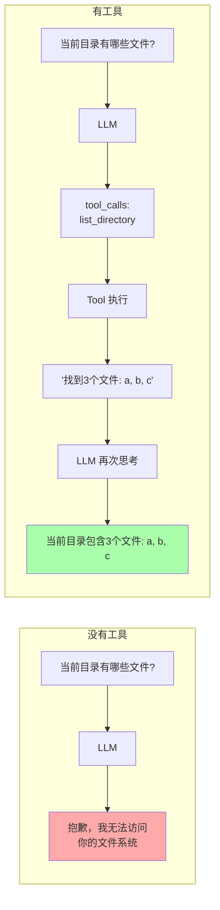
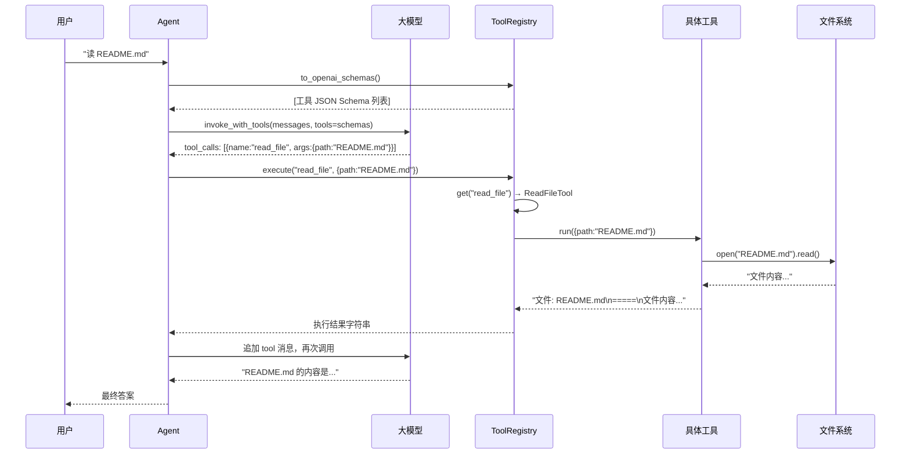
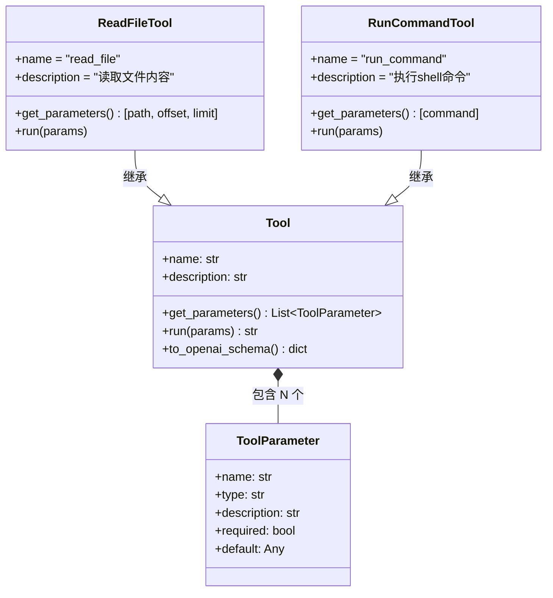
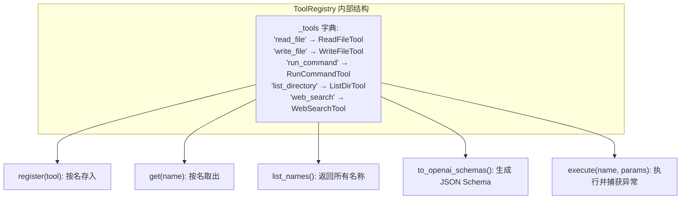
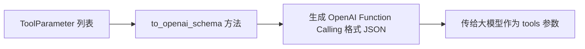
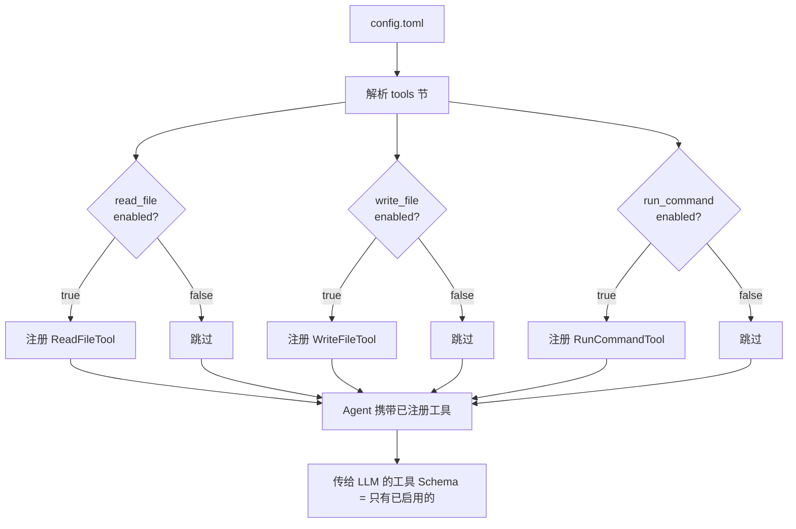
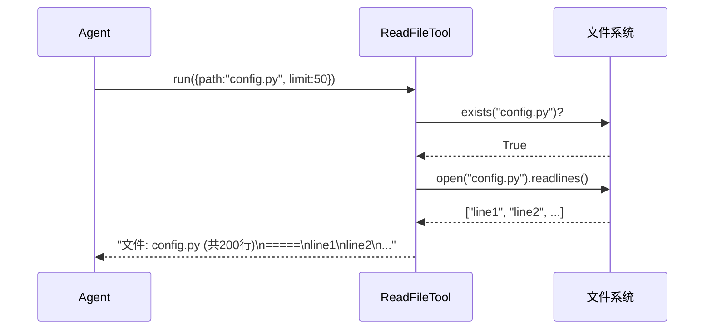
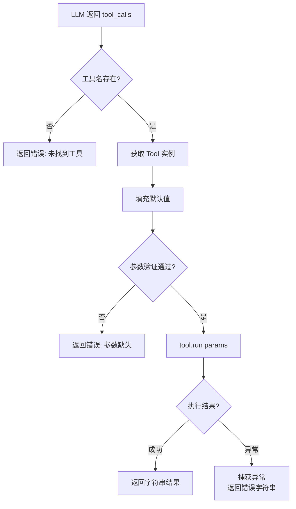

# P2: 可插拔工具系统 — Agent 的"手和脚"

## 学习目标

理解 Agent 如何通过工具与外部世界交互，掌握 JSON Schema 生成、注册表模式、工具参数验证、以及可插拔架构的设计方法。

---

## 一、没有工具 vs 有工具



工具就是 Agent 与外部世界交互的**唯一通道**。LLM 本身是一个纯函数的黑盒——输入文字，输出文字。工具让这个黑盒有了读写文件、执行命令、搜索网页的能力。

---

## 二、工具在 Agent 循环中的位置



---

## 三、工具的三要素



一个工具 = **名称**（模型用这个调用） + **描述**（模型判断何时调用） + **参数**（模型传什么输入）。

---

## 四、注册表模式（Registry Pattern）



关键代码 (`tools/base.py`):

```python
class ToolRegistry:
    def __init__(self):
        self._tools: Dict[str, Tool] = {}

    def register(self, tool: Tool):
        self._tools[tool.name] = tool

    def to_openai_schemas(self) -> List[dict]:
        return [tool.to_openai_schema() for tool in self._tools.values()]

    def execute(self, name: str, params: dict) -> str:
        tool = self.get(name)
        if not tool:
            return f"错误: 未找到工具 '{name}'"
        try:
            return str(tool.run(params))
        except Exception as e:
            return f"工具执行失败: {e}"
```

---

## 五、JSON Schema 生成（工具与 LLM 的握手协议）

这是工具系统里**最关键**的设计。LLM 需要结构化的工具描述才能决定何时调用哪个工具。

### 5.1 生成流程



### 5.2 类型映射

| Python type | JSON Schema type | 用途 |
|-------------|-----------------|------|
| `str` | `"string"` | 文件路径、搜索关键词 |
| `int` | `"integer"` | 行号、端口号 |
| `float` | `"number"` | 温度、概率值 |
| `bool` | `"boolean"` | 递归开关、是否确认 |
| `list` | `"array"` | 文件列表 |
| `dict` | `"object"` | 复杂配置 |

### 5.3 为什么 Schema 质量决定 Agent 质量？

```
Schema 写得好 → LLM 准确知道何时调用 → 工具调用正确率高
Schema 写得差 → LLM 不知道该调哪个 → 调错工具或忘调工具

关键:
- name: 简洁、唯一、见名知意 (read_file > rf)
- description: 说清楚"什么时候用"而不仅是"做什么"
  ❌ "读取文件"
  ✅ "当需要查看文件内容、代码、配置时使用。支持分页读取"
- parameters: 类型精确 (integer 不用 string)
```

---

## 六、可插拔设计



**可插拔的意义：** 工具越多 → Schema 越大 → Token 消耗越大 → LLM 选错工具的概率越高。按场景按需启用，精准控制。

---

## 七、5 个内置工具详解

### 7.1 read_file



| 参数 | 类型 | 必填 | 说明 |
|------|------|------|------|
| `path` | string | 是 | 文件路径 |
| `offset` | integer | 否 | 起始行号，默认 0 |
| `limit` | integer | 否 | 读取行数，默认 200 |

### 7.2 write_file

| 参数 | 类型 | 必填 | 说明 |
|------|------|------|------|
| `path` | string | 是 | 文件路径 |
| `content` | string | 是 | 写入内容 |

设计特点：自动创建父目录 (`os.makedirs`)，覆盖模式不追加。

### 7.3 run_command

| 参数 | 类型 | 必填 | 说明 |
|------|------|------|------|
| `command` | string | 是 | Shell 命令 |

设计特点：30 秒超时，同时捕获 stdout/stderr，输出截断 2000 字符。

### 7.4 list_directory

| 参数 | 类型 | 必填 | 说明 |
|------|------|------|------|
| `path` | string | 否 | 目录路径，默认 "." |
| `recursive` | boolean | 否 | 是否递归，默认 false |

设计特点：递归深度限制 2 层，避免扫出几千行输出。

### 7.5 web_search

| 参数 | 类型 | 必填 | 说明 |
|------|------|------|------|
| `query` | string | 是 | 搜索关键词 |

设计特点：使用 DuckDuckGo HTML 搜索，**零 API Key**，返回前 5 条结果。原理：`urllib` 请求 → 正则解析 HTML → 提取标题+摘要+URL。

---

## 八、工具执行的完整数据流



核心代码 (`tools/base.py`):

```python
def execute(self, name: str, params: dict) -> str:
    tool = self.get(name)
    if not tool:
        return f"错误: 未找到工具 '{name}'"
    try:
        for p in tool.get_parameters():
            if p.name not in params and p.default is not None:
                params[p.name] = p.default
        return str(tool.run(params))
    except Exception as e:
        return f"工具 '{name}' 执行失败: {e}"
```

---

## 九、如何添加一个新工具？

以添加一个 `get_current_time` 工具为例，只需 3 步：

```python
# 1. 定义工具类
class GetTimeTool(Tool):
    def __init__(self):
        super().__init__("get_current_time", "获取当前系统时间")

    def get_parameters(self):
        return []  # 无参数

    def run(self, params):
        from datetime import datetime
        return datetime.now().isoformat()

# 2. 注册
registry.register(GetTimeTool())

# 3. 在 config.toml 中加一行
# [tools.get_current_time]
# enabled = true
```
