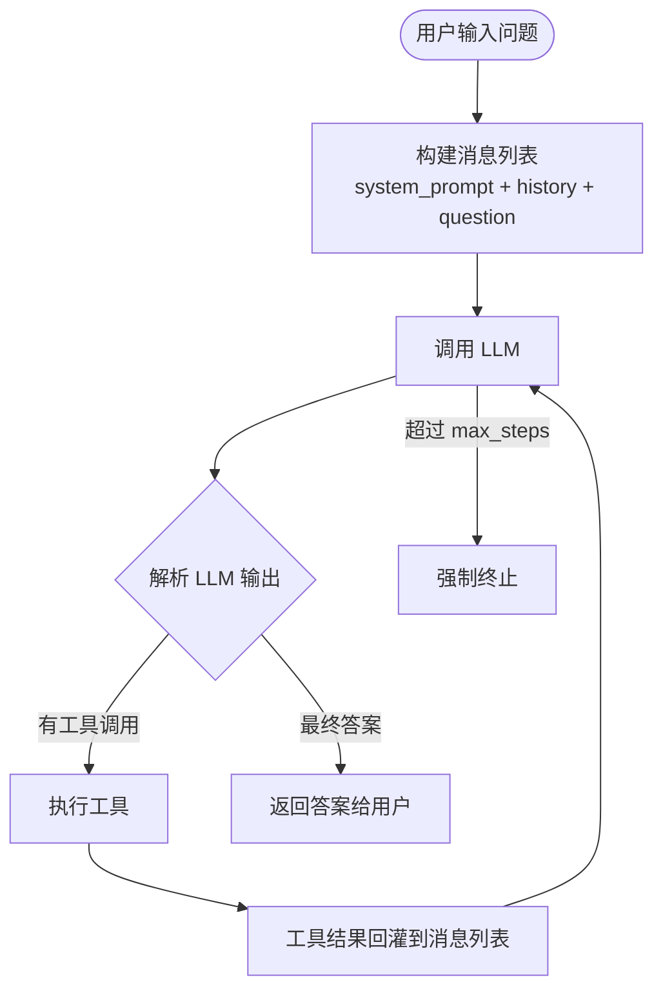
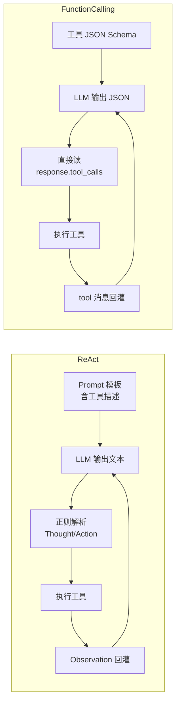
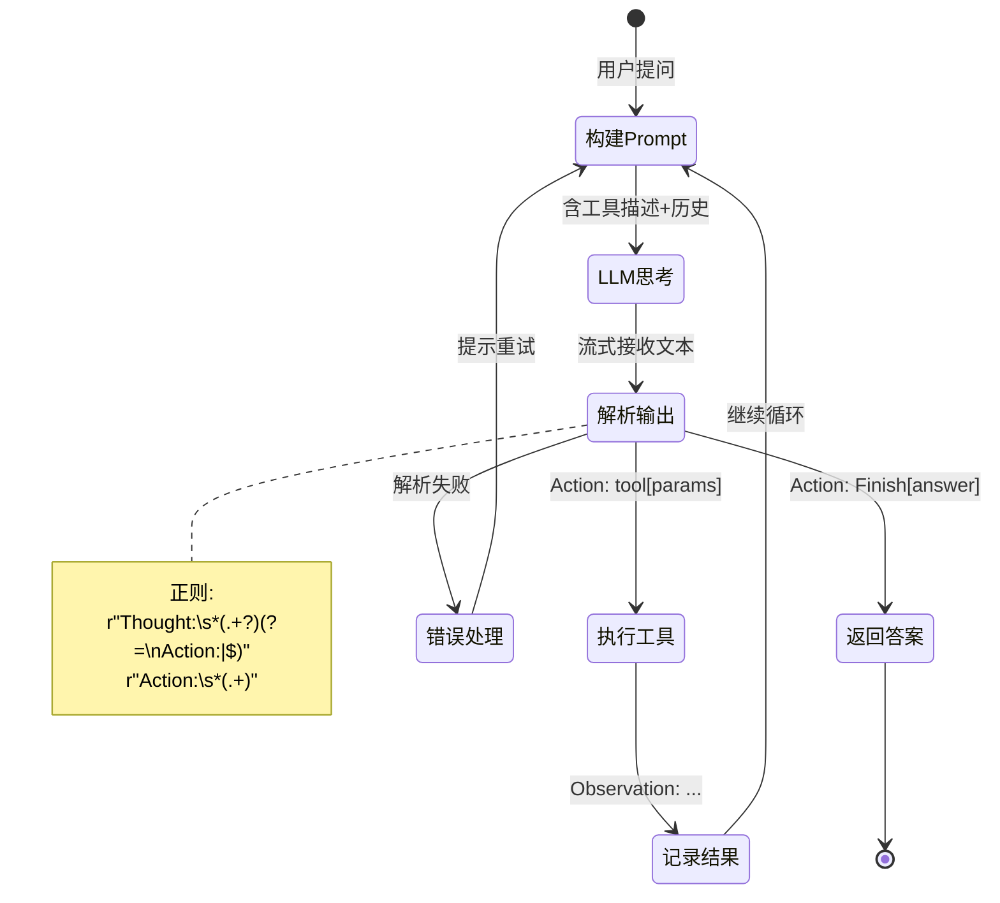
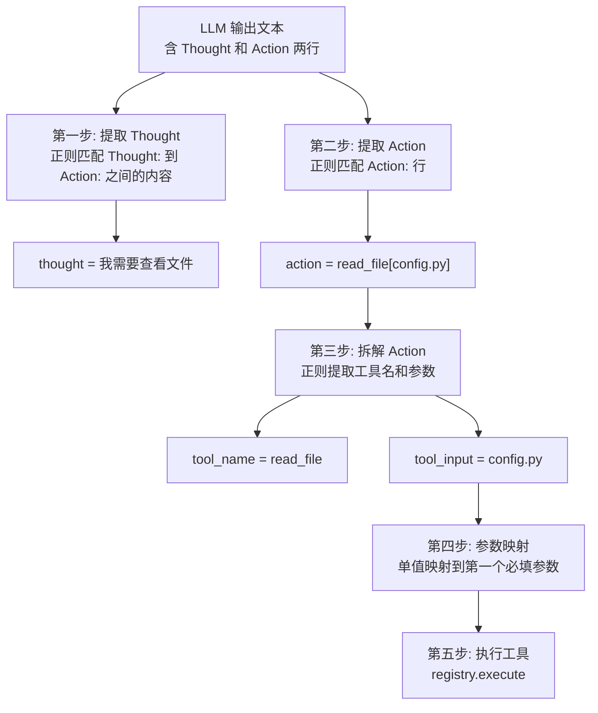
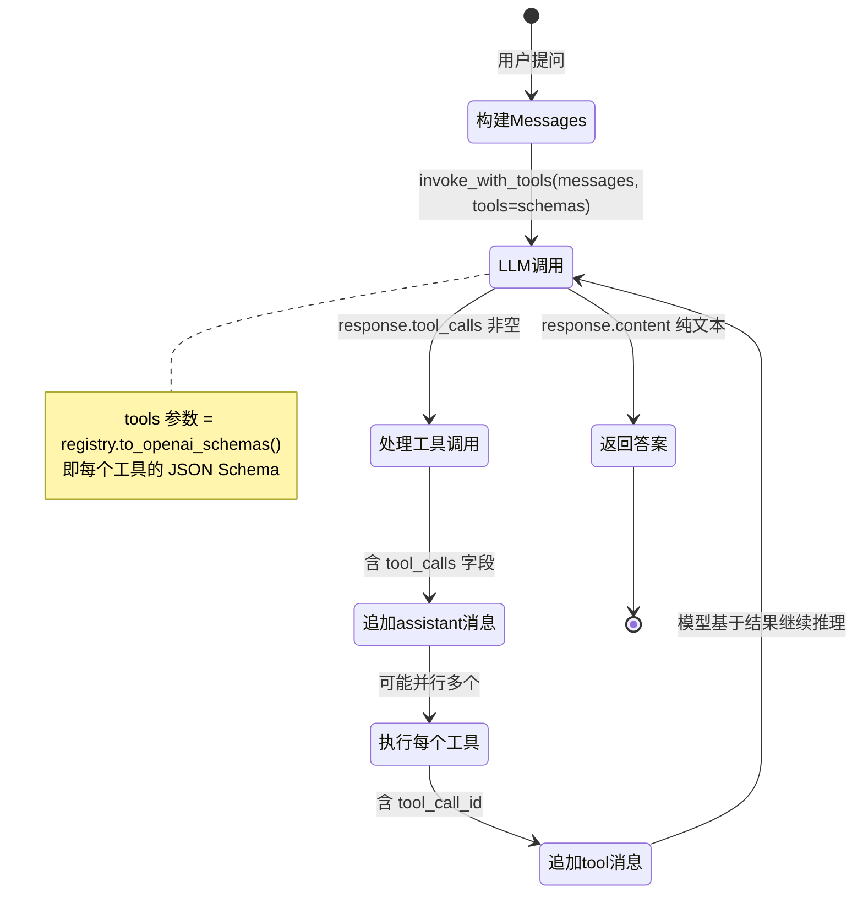
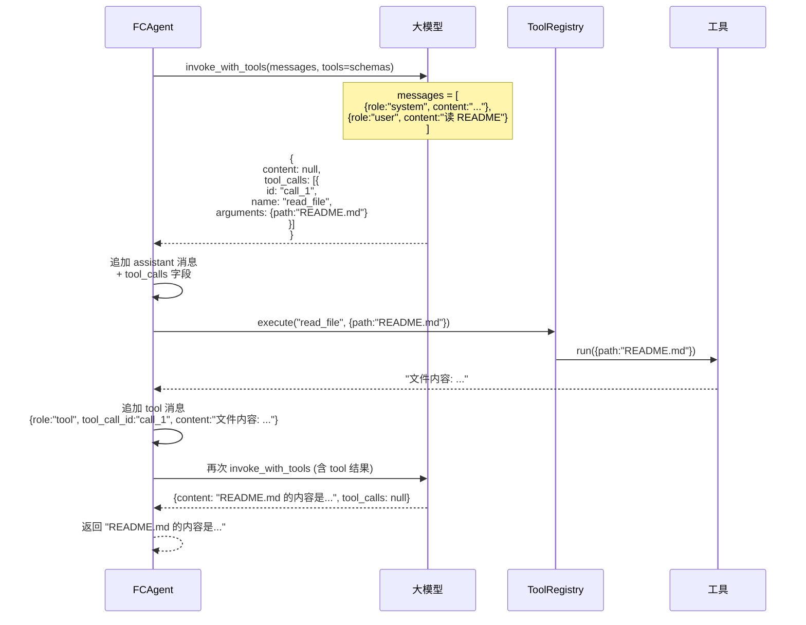
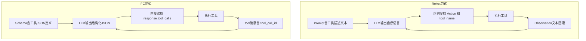
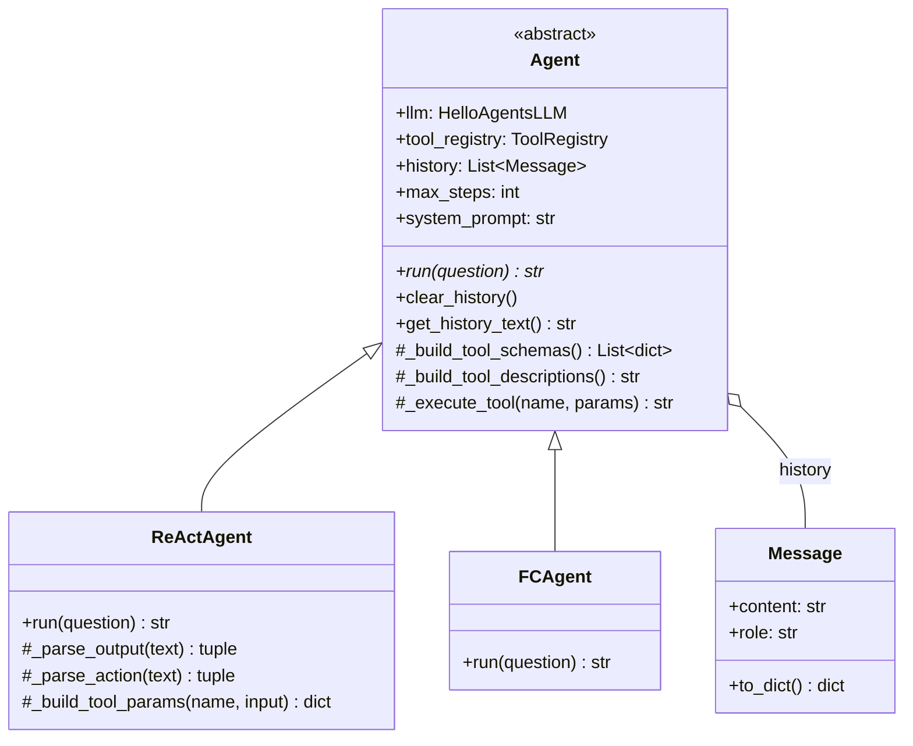

# P3 & P4: Agent 核心 — ReAct + Function Calling

## 学习目标

理解 Agent 的核心工作原理：**while 循环 + 工具调用**。掌握两种驱动范式（文本解析 vs 结构化 JSON），理解 Prompt 工程在 Agent 中的核心地位。

---

## 一、Agent 的本质：一个 while 循环



```python
# Agent 的本质，三行伪代码
while not done and step < max_steps:
    response = llm.think(messages)    # 思考
    action, params = parse(response)   # 解析动作
    result = execute(action, params)   # 执行工具
    messages.append(result)            # 反馈结果
```

这就是 Agent 的全部秘密——**不是魔法，是循环**。

---

## 二、两种驱动范式总览



| | ReAct | Function Calling |
|---|-------|-----------------|
| 模型要求 | **所有**对话模型 | 仅支持 FC 的模型 |
| 驱动方式 | 文本解析 | 结构化 JSON |
| 可靠性 | ~90%（正则可能失败） | ~99%（JSON 保证结构） |
| 并行工具 | 不支持 | 原生支持 |
| 推理可见性 | 完全可见（Thought） | 隐藏在模型内部 |
| Token 消耗 | Prompt 模板大 | JSON Schema 大 |

---

## 三、ReAct Agent 完整流程

### 3.1 ReAct 循环状态图



### 3.2 ReAct 的 Prompt 模板（Agent 的灵魂）

```
你是一个能调用工具的智能助手。

可用工具:
{tools}                ← 由 ToolRegistry 动态生成

请严格按以下格式回复:
Thought: 你的思考过程
Action: 下列格式之一 —
  tool_name[参数]     调用工具
  Finish[最终答案]    任务完成

开始!
Question: {question}
History: {previous_actions_and_observations}
```

**关键理解：** ReAct 不需要模型有 Function Calling 能力。工具调用是通过 Prompt 模板"教"模型用自然语言说出来的。这意味着本地模型（Ollama）、旧模型、甚至不支持 FC 的模型都能用。

### 3.3 ReAct 解析逻辑



### 3.4 ReAct 参数映射（关键实现）

ReAct 的 Action 中是纯文本参数 `read_file[config.py]`，但工具期望的是字典 `{"path": "config.py"}`。`_build_tool_params` 方法做智能映射：

```python
def _build_tool_params(self, tool_name, tool_input):
    tool = self.tool_registry.get(tool_name)
    params = tool.get_parameters()

    # 1. 尝试解析 key:value 格式
    #    例: list_directory[path: ".", recursive: false]
    if ":" in tool_input:
        return self._parse_kv_input(tool_input, params)

    # 2. 单值 → 映射到第一个必填参数
    #    例: read_file[config.py] → {"path": "config.py"}
    for p in params:
        if p.required:
            return {p.name: tool_input.strip()}
```

### 3.5 ReAct 的优势与局限

**优势：**
- 所有模型都支持，包括本地 Ollama 模型
- 推理过程完全透明（可以看到 Thought）
- Prompt 简单直观，易于调试
- 学习 Agent 原理的最佳入口

**局限：**
- 正则解析不是 100% 可靠（模型有时不遵守格式）
- 不能一次调用多个工具
- Prompt 模板自身占 token

---

## 四、Function Calling Agent 完整流程

### 4.1 FC 循环状态图



### 4.2 FC 消息结构（与 ReAct 的关键区别）



### 4.3 FC 并行工具调用

FC 的核心优势之一：**一次 LLM 调用可以触发多个工具并行执行**。

```
用户: "列出目录文件并读 config.toml"

LLM 一次返回:
{
  tool_calls: [
    {id:"1", name:"list_directory", arguments:{path:"."}},
    {id:"2", name:"read_file", arguments:{path:"config.toml"}}
  ]
}

Agent 执行:
  并行: list_directory(".")  +  read_file("config.toml")
        ↓                          ↓
     "3个文件:..."           "内容: [project]..."
        ↓                          ↓
  追加两条 tool 消息 → 再次调用 LLM → 综合答案
```

---

## 五、两种范式对比总结



对比维度总结：

| 维度 | ReAct | Function Calling |
|------|-------|-----------------|
| 驱动方式 | Prompt 教模型"说"工具调用 | LLM 原生支持，输出 JSON |
| 解析方式 | 正则表达式 | 直接访问 Python 字段 |
| 模型兼容性 | 任何对话模型 | 需 API 支持 tools 参数 |
| 并行工具调用 | 不支持 | 原生支持 |
| 推理过程 | 完全可见 (Thought) | 隐藏 |
| 可靠性 | ~90% | ~99% |
| 调试友好度 | 极高（看 Thought） | 一般（看不到推理） |
| 学习价值 | 理解 Agent 本质 | 工业级最佳实践 |

---

## 六、Agent 基类的设计



基类封装了所有 Agent 共用的基础设施：LLM 客户端、工具注册表、历史管理、步数限制。子类只需实现 `run()` 方法，决定用什么策略驱动工具调用。
