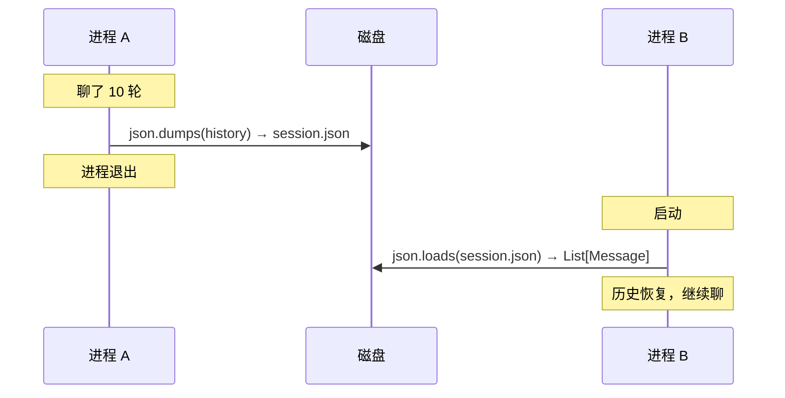
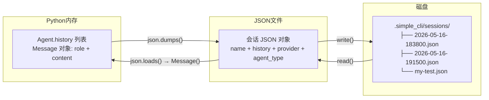
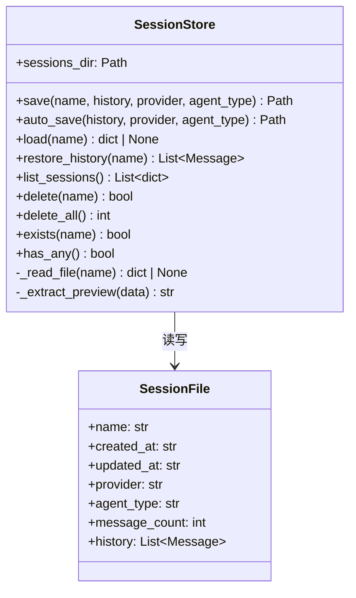
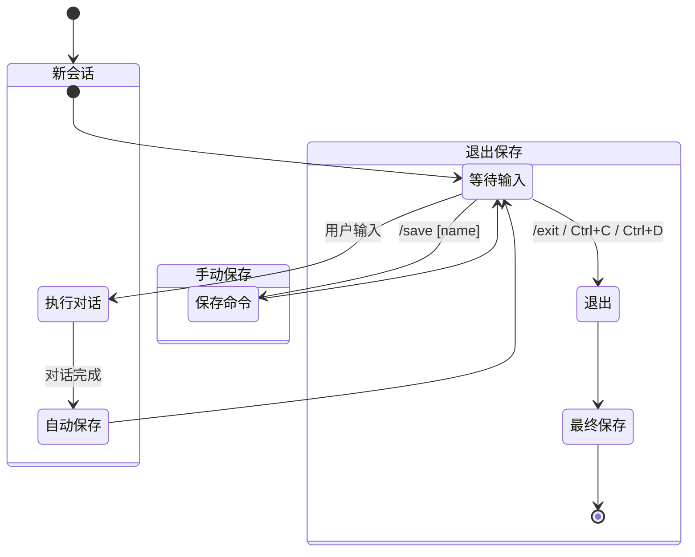
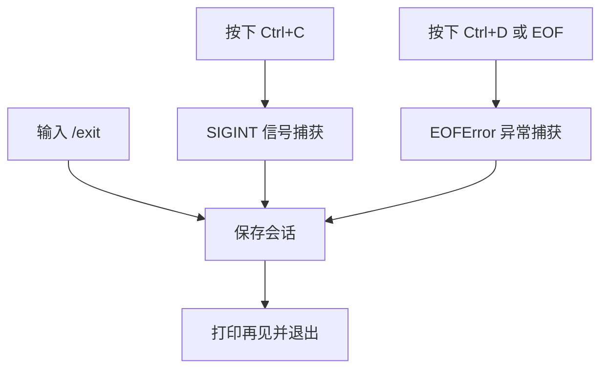
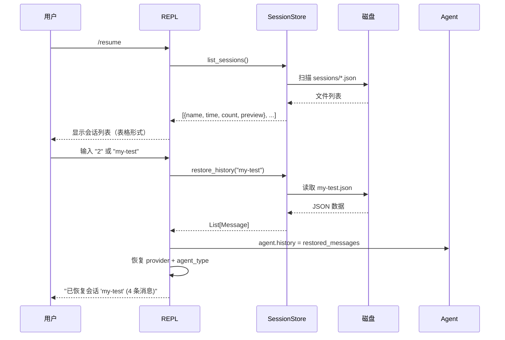
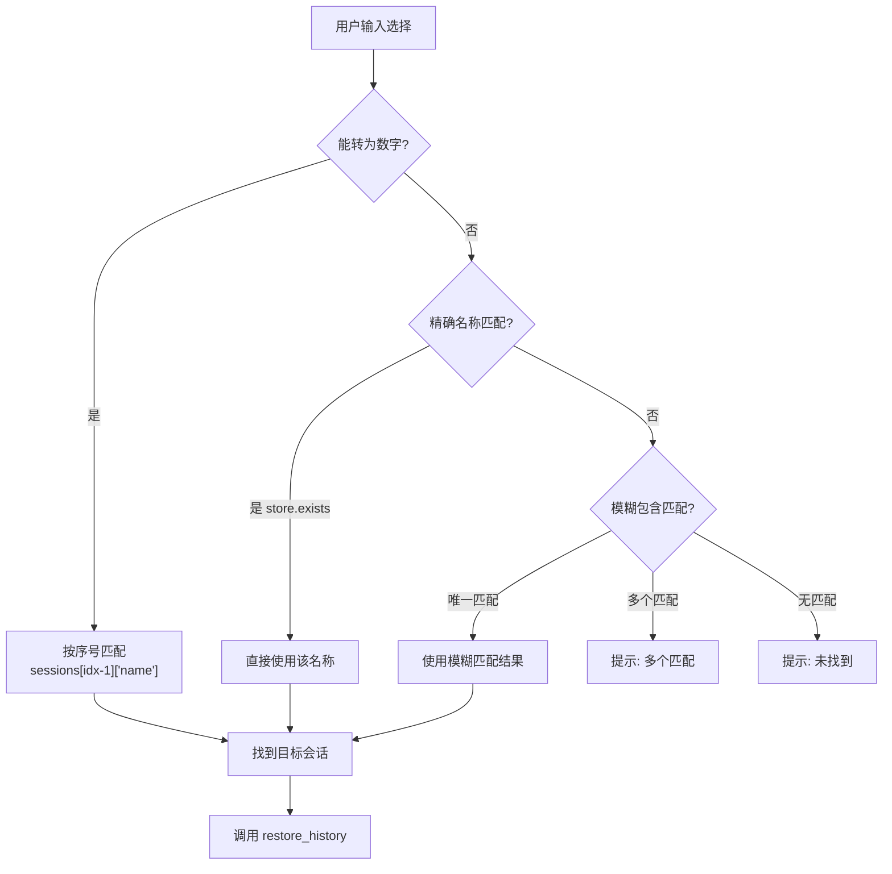
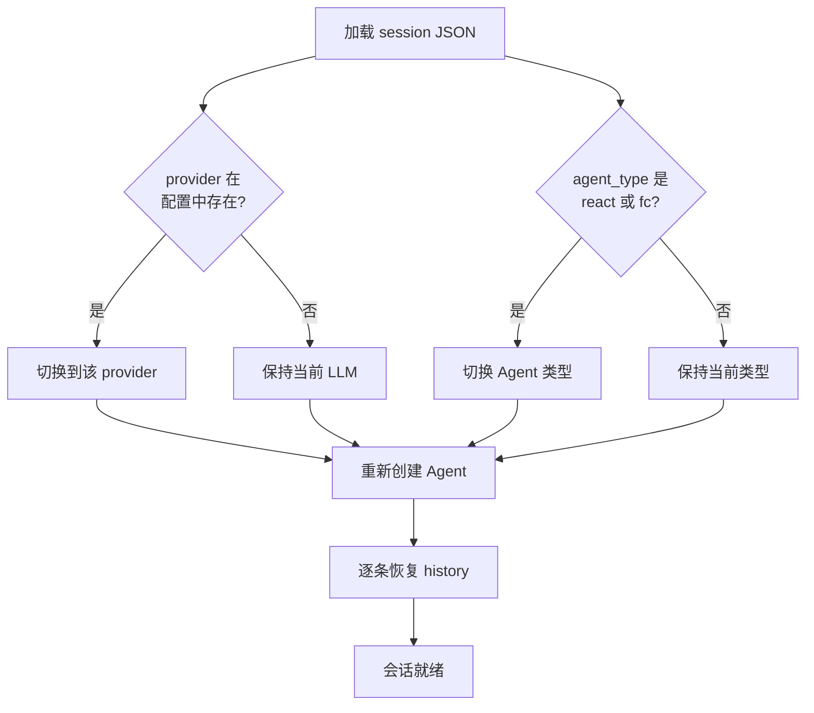

# P7 & P8: 会话持久化与多会话管理

## 学习目标

理解 Agent 如何实现跨进程"记忆"——序列化/反序列化、多会话管理、`/resume` 交互设计、以及退出安全机制。

---

## 一、从失忆到记忆



没有持久化时，Agent 每次启动都是"白纸一张"。持久化让它能"记住上次聊了什么"。

---

## 二、数据流：Python ↔ JSON ↔ 磁盘



---

## 三、SessionStore 类设计



### 关键方法详解

| 方法 | 输入 | 输出 | 用途 |
|------|------|------|------|
| `save(name, ...)` | 会话名 + 历史 + 配置 | 文件路径 | 命名保存 |
| `auto_save(...)` | 历史 + 配置 | 文件路径 | 时间戳自动命名 |
| `load(name)` | 会话名 | dict 或 None | 读取会话数据 |
| `restore_history(name)` | 会话名 | `List[Message]` | 恢复为消息对象 |
| `list_sessions()` | 无 | 会话列表（按时间倒序） | `/sessions` 和 `/resume` 命令 |
| `delete(name)` | 会话名 | bool | 删除单个会话 |

---

## 四、三个保存时机



| 时机 | 触发方式 | 目的 |
|------|----------|------|
| ① 自动保存 | 每次 `agent.run()` 完成后 | 防崩溃丢数据 |
| ② 手动保存 | `/save` 或 `/save myname` | 标记重要节点 |
| ③ 退出保存 | `/exit`、Ctrl+C、Ctrl+D | 确保最新对话不丢失 |

### 退出安全的三条路径



关键代码：

```python
# 注册 Ctrl+C 处理器
signal.signal(signal.SIGINT, _handle_interrupt)

# 主循环中捕获 Ctrl+D
try:
    user_input = input("> ").strip()
except (EOFError, KeyboardInterrupt):
    # 保存后退出
    _do_save(store, agent, current_provider, current_mode, current_session_name)
    break
```

---

## 五、/resume 恢复交互设计

### 5.1 完整交互流程



### 5.2 三级匹配策略



```python
# ① 按序号
try: idx = int(choice) - 1; target = sessions[idx]["name"]
except: pass

# ② 按名称精确匹配
if store.exists(choice): target = choice

# ③ 模糊匹配
matches = [s for s in sessions if choice.lower() in s["name"].lower()]
if len(matches) == 1: target = matches[0]
elif len(matches) > 1: print("多个匹配...")
```

### 5.3 恢复时同时恢复配置



---

## 六、会话文件格式

```json
{
  "name": "my-test",
  "created_at": "2026-05-16T18:47:00",
  "updated_at": "2026-05-16T18:50:00",
  "provider": "deepseek",
  "agent_type": "fc",
  "message_count": 4,
  "history": [
    {"role": "user", "content": "我的名字是赵六"},
    {"role": "assistant", "content": "你好，赵六！"},
    {"role": "user", "content": "我叫什么名字？"},
    {"role": "assistant", "content": "你叫赵六"}
  ]
}
```

**各字段的设计理由：**

| 字段 | 为什么需要 |
|------|-----------|
| `name` | 文件名即会话名，列目录即可获取 |
| `created_at` | 首次创建时记录，后续覆盖不改变（保留"开始时间"） |
| `updated_at` | 每次保存更新（排序和展示用） |
| `provider` | 恢复时自动切回当时的模型 |
| `agent_type` | 恢复时自动切回当时的 Agent 范式 |
| `message_count` | **冗余字段**，避免列出所有会话时逐个读取文件统计 |

---

## 七、为什么用 JSON 而不是其他格式？

| 方案 | 优势 | 劣势 | 适用场景 |
|------|------|------|----------|
| **JSON** | 零依赖、人类可读、`cat` 就能看 | 大文件慢、无索引 | **学习阶段** |
| SQLite | 支持 SQL 查询、事务安全 | 需要额外库、不可直接阅读 | 生产环境 |
| pickle | Python 原生序列化 | 不安全、跨版本不兼容 | **永远不要用** |
| SQLAlchemy + PostgreSQL | 完整 ORM、并发、索引 | 重依赖、过度设计 | 企业级应用 |

---

## 八、与 Claude Code 的对比

| 能力 | Claude Code | simple-cli |
|------|------------|------------|
| 会话存储 | 内置自动 | 自动 + 手动 |
| 恢复命令 | `/resume` | `/resume [name]` |
| 多会话 | 支持 | 支持 |
| 会话预览 | 首条消息 | 首条用户消息 60 字符 |
| 存储格式 | 未公开 | JSON，人类可读 |
| 配置恢复 | 自动 | 自动恢复 provider + mode |
| 退出安全 | 3 种退出方式均保存 | 3 种退出方式均保存 |
