# P11: 上下文窗口管理 — Token 计数 + 历史压缩 + 滑动窗口

## 学习目标

理解 Agent 如何处理"长对话"问题：如何用 tiktoken 精确计算 token？如何在接近窗口上限时自动压缩历史？如何让谈话无限继续而不丢失关键上下文？

---

## 一、这个模块解决什么问题？

Agent 是一个 while 循环：每轮对话都把完整历史发给 LLM。聊 100 轮后，历史可能有 50000+ token。每个模型都有 context window 上限（DeepSeek 64K），超出就报错。

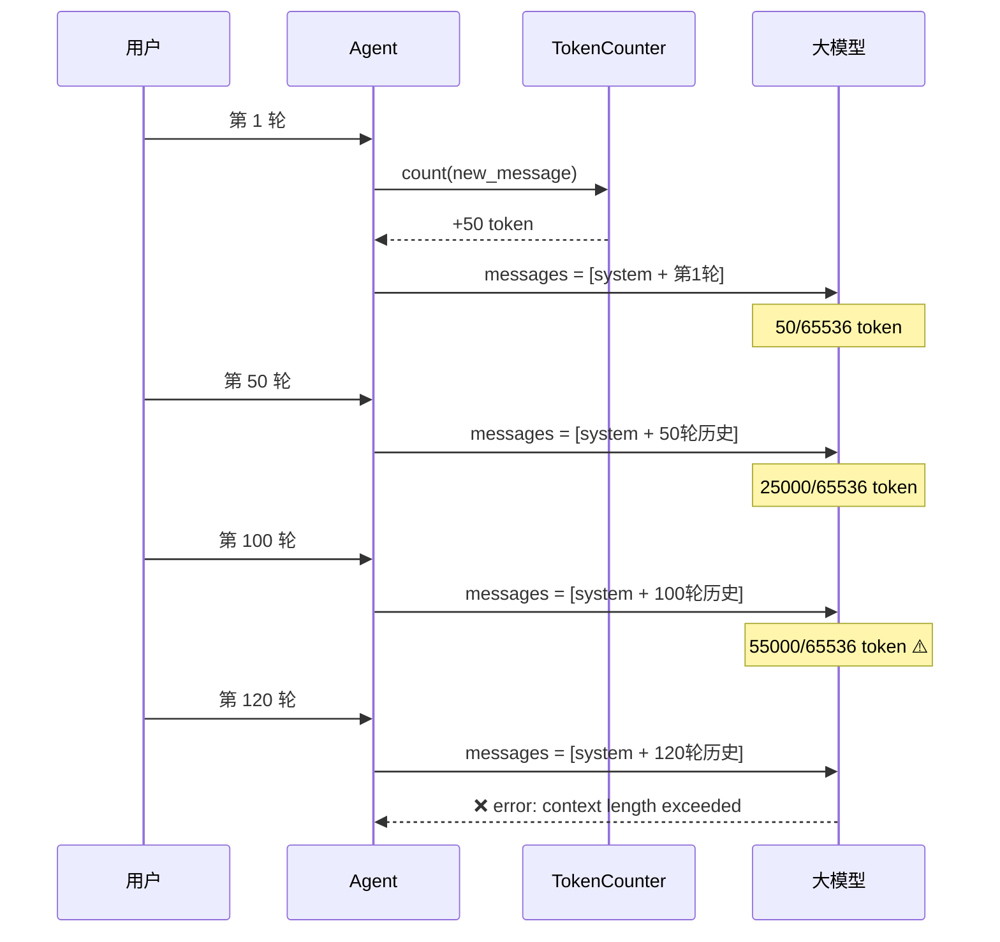

**上下文窗口管理**就是给这个循环加上"自我感知"和"自动减肥"能力。

---

## 二、整体架构：三件套协作

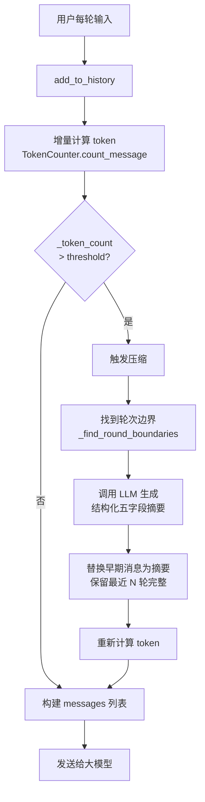

三个组件各司其职：

| 组件 | 职责 | 关键方法 |
|------|------|----------|
| `TokenCounter` | 精确计算 token 数 | `count(text)`, `count_message(msg)` |
| `HistoryCompressor` | 触发判断 + 压缩执行 | `should_compress()`, `compress()` |
| `Agent._do_compress` | 编排压缩流程 | 调用 Compressor → 重建 history |

---

## 三、Token 计数原理

### 3.1 为什么用 tiktoken？

LLM 看到的不是"字"，而是 **token**——模型词汇表中的编码单元。同样的文字，不同模型的 tokenizer 会产生不同的 token 数。

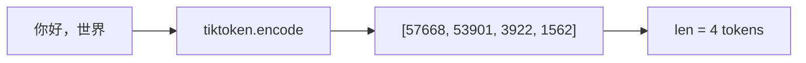

| 估算方法 | 中文误差 | 英文误差 | 问题 |
|----------|---------|---------|------|
| `len(text)` | ~70% | ~25% | 1 中文字 = 2-3 token |
| `len(text) / 2` | ~20% | ~35% | 1 英文词 = 0.75 token |
| **tiktoken** | **~1%** | **~1%** | 直接用模型的真实编码器 |

### 3.2 增量计数 vs 全量计数

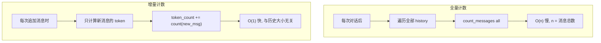

核心代码 (`agent/base.py:add_to_history`):

```python
def add_to_history(self, content: str, role: str):
    self.history.append(Message(content, role))
    # 增量: 只算新消息
    self._token_count += self.token_counter.count_message(content)
    # 检查是否超限
    if self._compressor.should_compress(self._token_count):
        self._do_compress()
```

### 3.3 编码映射

不同的模型用不同的 tokenizer。`TokenCounter` 自动匹配：

```python
ENCODING_MAP = {
    "gpt-4o": "o200k_base",       # 最新编码
    "gpt-4": "cl100k_base",        # GPT-4 编码
    "deepseek-chat": "cl100k_base", # DeepSeek 兼容 GPT-4 编码
    "glm-4": "cl100k_base",
    "qwen": "cl100k_base",
    "default": "cl100k_base",      # 回退方案
}
```

---

## 四、历史压缩原理

### 4.1 压缩完整流程

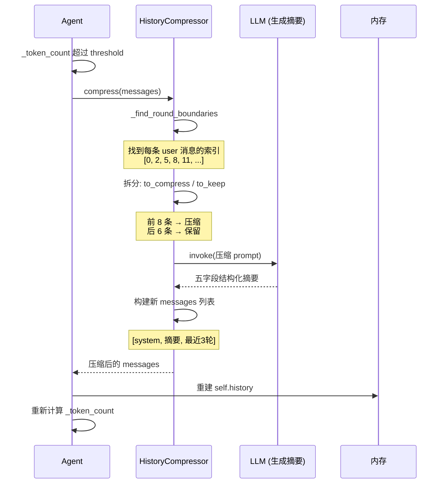

### 4.2 轮次边界查找

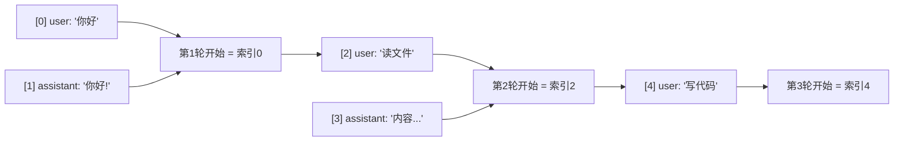

每一轮从 `role == "user"` 的消息开始。`_find_round_boundaries` 扫描所有消息，记录每条 user 消息的索引位置。

### 4.3 滑动窗口策略

```
压缩前 (15 条消息, 5 轮对话):
  [轮1: user + assistant]
  [轮2: user + assistant + tool + assistant]
  [轮3: user + assistant]
  [轮4: user + assistant + tool + assistant]
  [轮5: user + assistant]

轮次边界 = [0, 2, 6, 8, 12]
保留最近 3 轮 → 从索引 6 开始保留

结果:
  to_compress = [轮1, 轮2]  → 压缩为摘要
  to_keep     = [轮3, 轮4, 轮5]  → 保留完整

压缩后 messages:
  [
    {role: "system", content: system_prompt},
    {role: "system", content: "[历史摘要] ## 历史摘要（2轮）\n1. 任务目标: ..."},
    {role: "user", content: "轮3问题"}, ...
  ]
```

### 4.4 压缩 Prompt 设计（参考 Claude Code 格式）

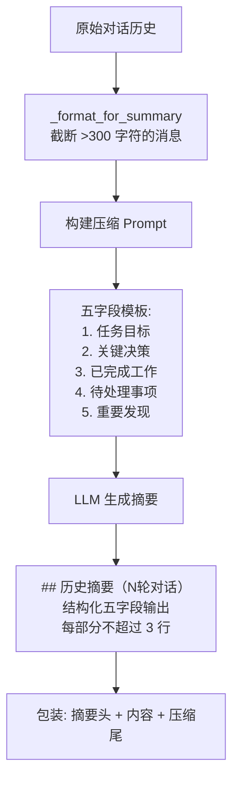

**关键设计：** 每个字段限制"不超过 3 行"，防止摘要本身膨胀。如果 LLM 调用失败，回退到 `_simple_summary`（用统计信息填充相同格式）。

---

## 五、集成到 Agent 生命周期

### 5.1 在 add_to_history 中的位置

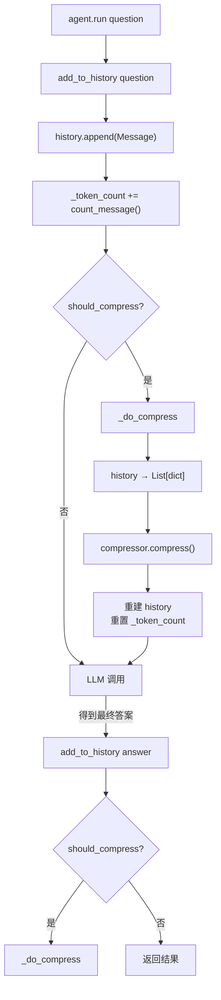

### 5.2 _build_base_messages 的作用

所有 Agent 子类通过 `_build_base_messages()` 获取基础消息列表，它自动处理：

```python
def _build_base_messages(self) -> List[dict]:
    messages = []
    # ① 系统提示
    if self.system_prompt:
        messages.append({"role": "system", "content": self.system_prompt})
    # ② 历史摘要（如果已压缩过）
    if self._summary:
        messages.append({"role": "system", "content": self._summary})
    # ③ 当前历史（已压缩过的，不含摘要）
    for msg in self.history:
        messages.append(msg.to_dict())
    return messages
```

这样压缩对子类完全透明——FCAgent 和 ReActAgent 不需要修改任何逻辑。

---

## 六、关键设计决策

### 6.1 压缩阈值：为什么是 80%？

```
threshold = 65536 * 0.8 = 52428 token

预留 20%（~13000 token）给：
  - LLM 的输出（非流式的完整 response）
  - tool_calls 的 JSON 开销
  - 工具执行结果回灌
  - 压缩摘要自身
```

### 6.2 保留轮数：为什么默认 3 轮？

```
min_retain_rounds = 3

1 轮 — 只有当前上下文，容易断
2 轮 — 少了一层的缓冲
3 轮 — 最近的操作链条完整（提问→工具调用→修正→确认）
```

### 6.3 压缩用主模型还是轻量模型？

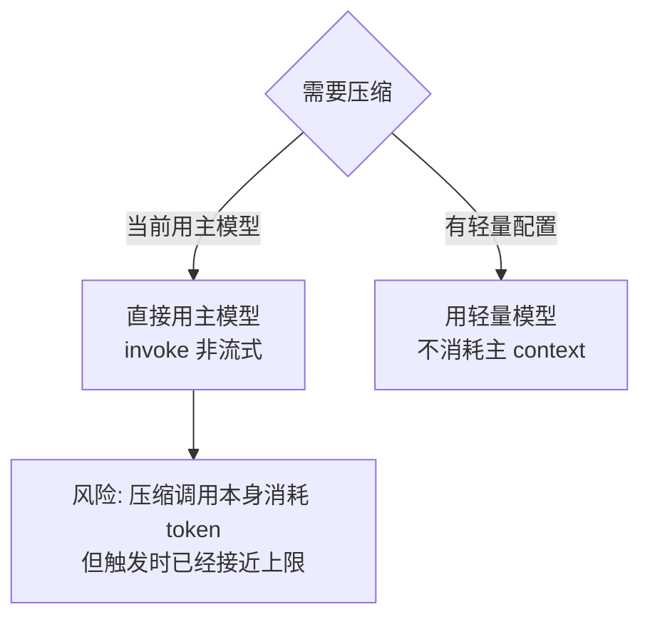

**当前实现：** 用主模型（简洁可靠）。未来可扩展为独立压缩模型。

### 6.4 压缩失败回退

```python
try:
    response = self.llm.invoke(compress_prompt, ...)
    return response.content  # LLM 结构化摘要
except Exception:
    return self._simple_summary(messages)  # 回退: 统计信息
    # "## 历史摘要（5轮对话）\n1. 任务目标: 构建Web应用\n..."
```

即使 LLM 不可用，回退方案也保持**相同的五字段格式**（标注"未提取"），确保下游代码不需要处理两种格式。

---

## 七、类设计

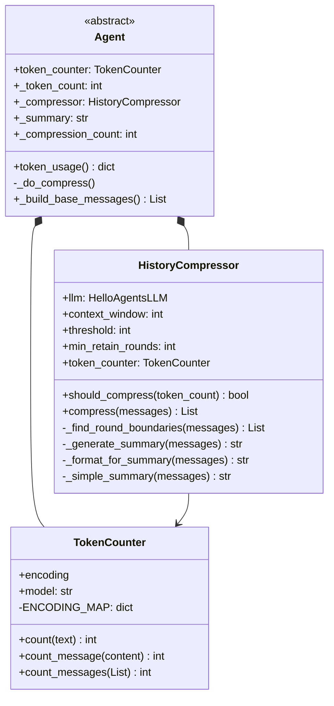

---

## 八、与 Claude Code 的对比

| 维度 | Claude Code | simple-cli（本项目） |
|------|------------|---------------------|
| Token 计数 | 内置，模型相关 | tiktoken + 编码映射 |
| 计数策略 | 精确（推测增量） | **增量计数**，O(1) |
| 压缩触发 | 自适应阈值 | `context_window * 0.8` |
| 压缩方式 | LLM 智能摘要 | **LLM 五字段结构化摘要** |
| 滑动窗口 | 保留最近 N 轮 | 保留 `min_retain_rounds` 轮 |
| 摘要格式 | 结构化（未公开细节） | **五字段**: 目标/决策/已完成/待处理/发现 |
| 失败回退 | 无（推测内置处理） | **同格式回退**，标注"未提取" |
| 集成方式 | 框架层 | `add_to_history` 透明集成 |
| 压缩统计 | 未公开 | `token_usage()` 实时查询 |

---

## 九、完整数据流总结

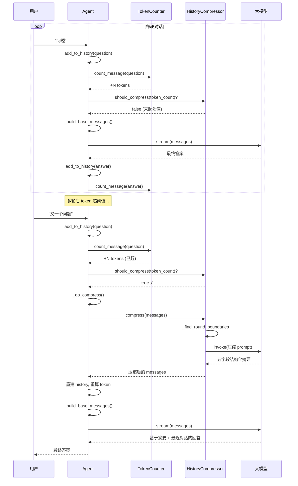
