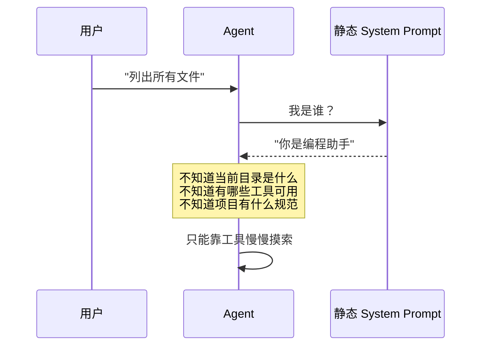
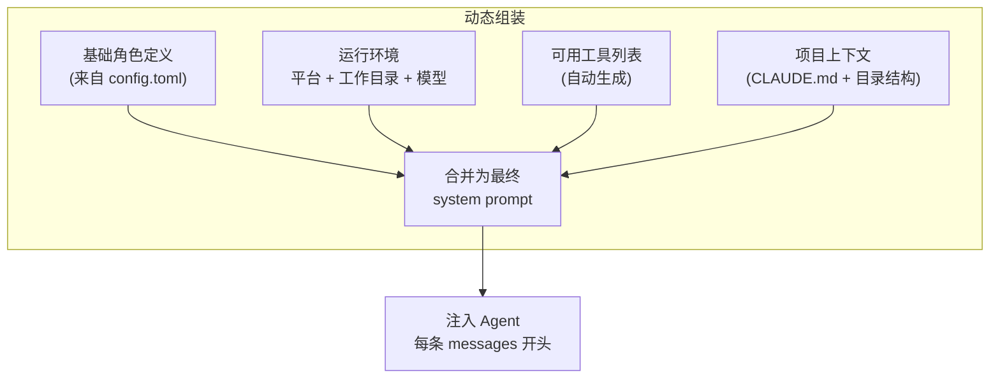
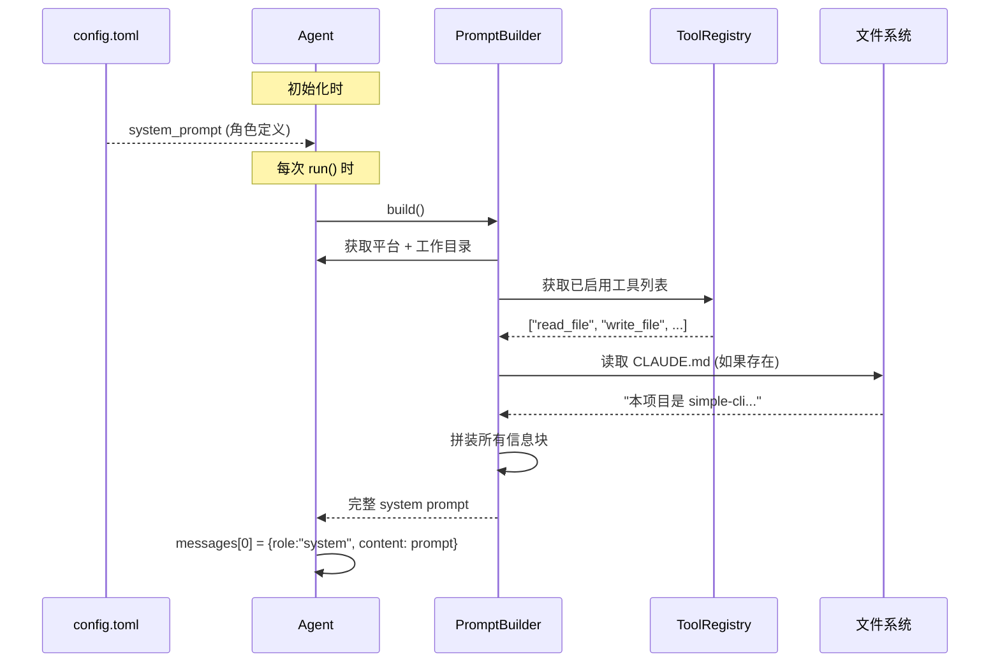
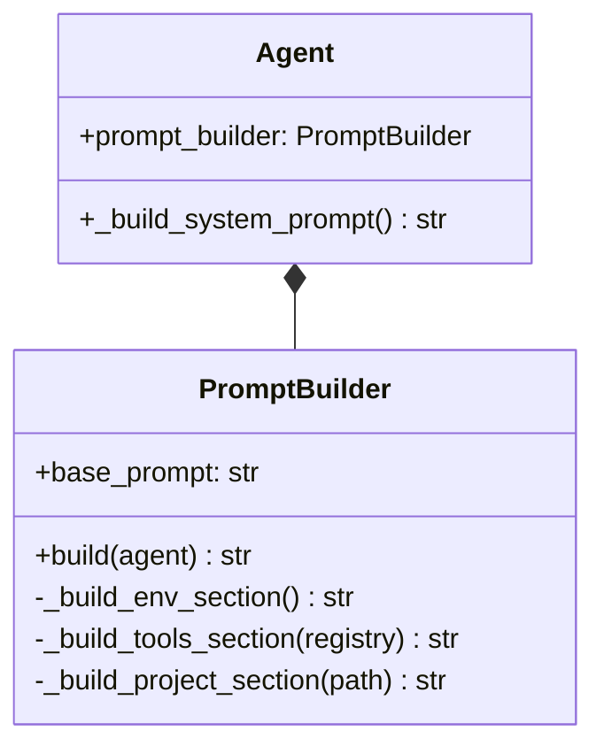

# T1-①: 系统提示增强 — 动态上下文注入

## 学习目标

理解 Agent 的系统提示不是"一段静态文本"，而应该是一个**动态组装的上下文包**——根据运行环境、项目状态、可用工具实时变化。

---

## 一、问题：静态提示的局限

当前 simple-cli 的系统提示是 `config.toml` 中的一段固定文本：

```
你是一个名为 simple-cli 的 AI 编程助手，运行在终端中...
```

问题：Agent 不知道自己在哪个目录、有什么工具、项目有什么规范。



## 二、动态系统提示的设计



## 三、五个注入维度

| 维度 | 内容 | 示例 |
|------|------|------|
| **角色定义** | config.toml 中的 system_prompt | "你是一个 AI 编程助手..." |
| **运行环境** | 平台、工作目录、当前模型 | "OS: Windows, CWD: /project" |
| **可用工具** | ToolRegistry 中已启用的工具 | "可用: read_file, write_file, ..." |
| **项目上下文** | CLAUDE.md 内容 | "本项目是 simple-cli，一个 Agent 学习..." |
| **对话状态** | 压缩摘要、步数信息 | "已压缩 2 次，当前第 5 轮" |

## 四、动态组装流程



## 五、拼装后的最终格式

```
你是一个名为 simple-cli 的 AI 编程助手...

## 运行环境
- 操作系统: Windows
- 当前目录: E:/codexProgram/sinmple-cli
- 当前模型: deepseek-chat
- Agent 类型: fc
- Python: 3.14.2

## 可用工具
- read_file(path, offset, limit): 读取文件内容
- write_file(path, content): 创建或覆盖文件
- run_command(command): 执行 shell 命令
- list_directory(path, recursive): 列出目录结构
- web_search(query): 网页搜索

## 项目上下文
本项目是 simple-cli，一个从零学习 Agent 原理的终端 AI 助手...
```

## 六、与 Claude Code 的对比

| 维度 | Claude Code | simple-cli（优化后） |
|------|------------|---------------------|
| 角色定义 | 数千字精细规则 | config.toml 自定义 |
| 环境感知 | 平台 + 工作目录 + 模型族 | 同上 |
| 工具感知 | 全部可用工具 | 已启用工具列表 |
| 项目感知 | CLAUDE.md + memory/ | CLAUDE.md 自动加载 |
| 动态性 | 每次调用前组装 | 每次 run() 前组装 |

## 七、代码架构


