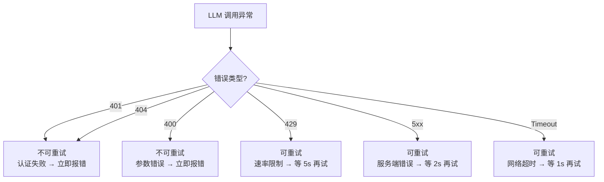
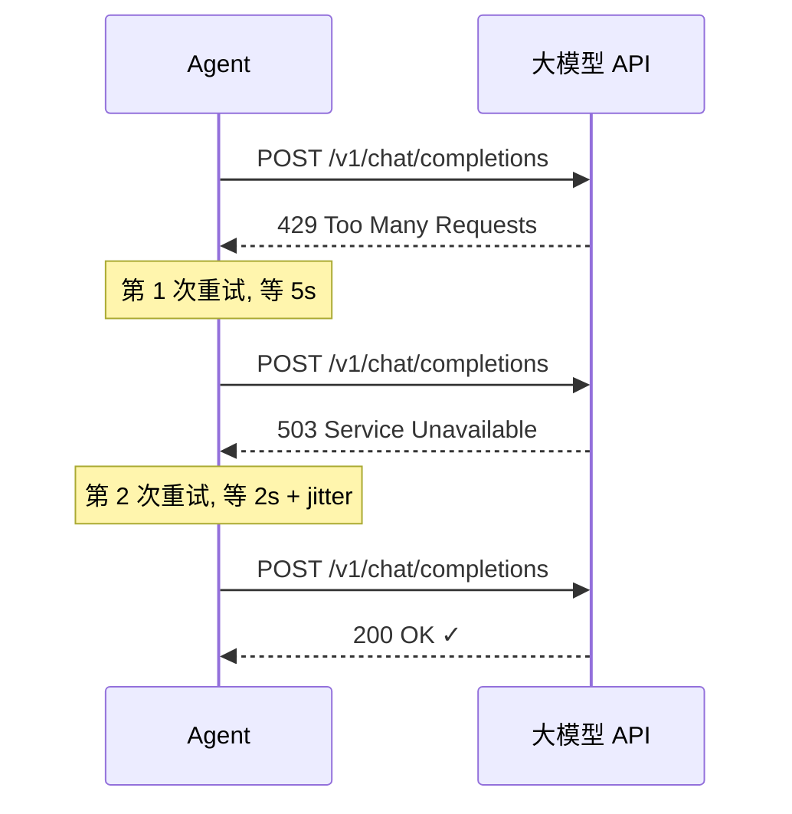

# T1-③: 错误恢复 — 重试 + 指数退避

## 学习目标

理解 Agent 如何优雅处理 LLM 调用失败：区分可重试错误和不可重试错误，用指数退避避免服务端过载。

---

## 一、问题：Agent 很"脆"

当前 simple-cli 的 LLM 调用一旦失败就直接返回错误，终止循环：

```
429 Rate Limit → ❌ 立即报错
5xx 服务端错 → ❌ 立即报错
网络抖动    → ❌ 立即报错
```

一个暂时的服务端波动就可能让 Agent 无功而返。

## 二、错误分类



## 三、指数退避原理

```
第 1 次重试: 等 1 秒
第 2 次重试: 等 2 秒
第 3 次重试: 等 4 秒
第 4 次重试: 等 8 秒
...
max_wait = 30 秒

加上随机抖动 (±25%) 避免"惊群效应"（所有请求同时重试）
```



## 四、与 Claude Code 对比

| 维度 | Claude Code | simple-cli |
|------|------------|------------|
| 重试机制 | 内置 | 新增 |
| 退避策略 | 指数退避 | 指数退避 + jitter |
| 最大重试 | 推测 3 次 | 默认 3 次 |
| 429 处理 | 等待 Retry-After 头 | 固定 5s 等待 |

## 五、设计决策

**为什么不是无限重试？**
- 3 次之后大概率不是临时故障
- 每次重试消耗 API 额度（可能已经扣了 token）
- 用户等待太久体验差

**429 为什么等 5 秒？**
- 429 表示服务端主动限流，等久一点
- 5xx 可能是瞬时故障，等 2 秒就够
- Timeout 通常是网络抖动，1 秒后大概率恢复
