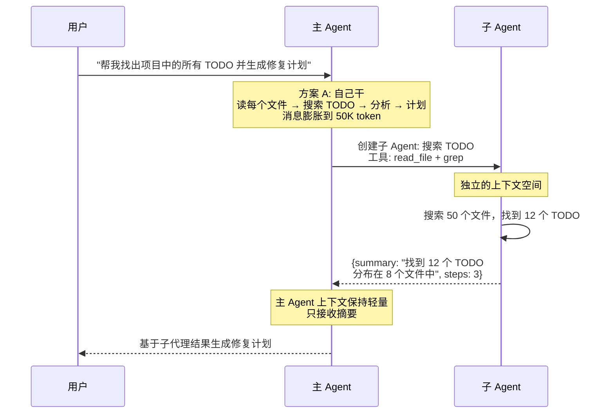
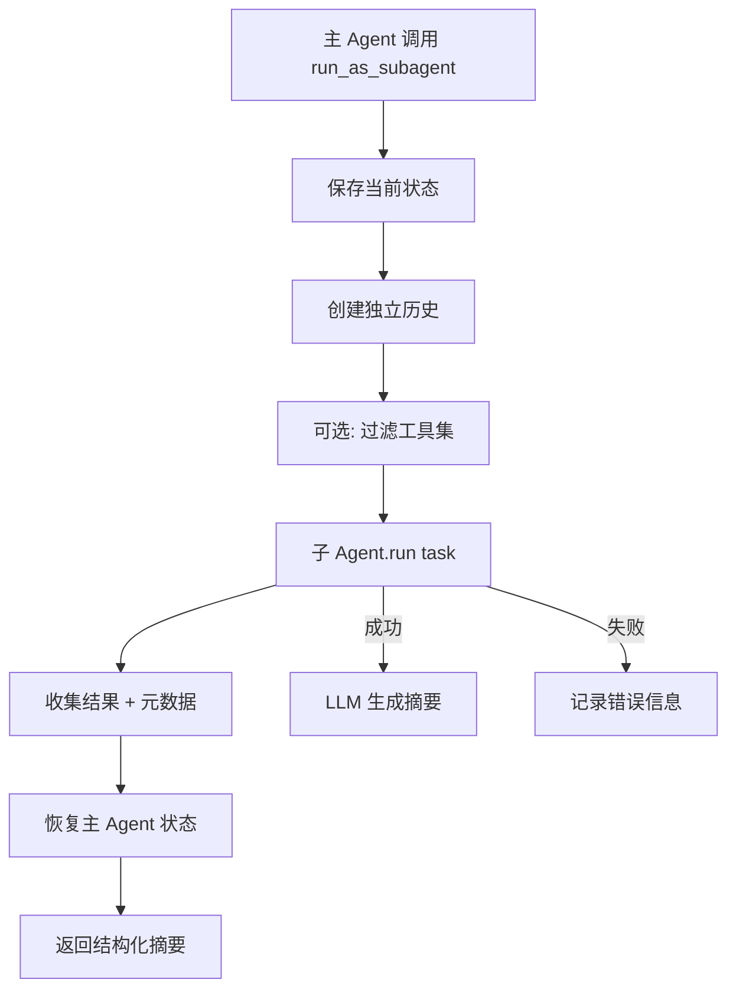
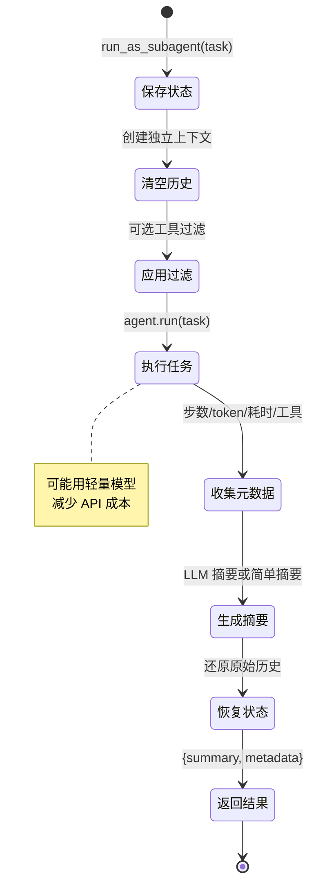

# T2-④: 子代理（Sub-Agent）— 上下文隔离 + 摘要返回

## 学习目标

理解 Agent 如何创建和管理子代理：上下文隔离、工具过滤、摘要返回、并行执行。这是从"单 Agent"到"多 Agent 系统"的关键一步。

---

## 一、为什么需要子代理？



**核心价值：** 主 Agent 上下文不膨胀，子 Agent 并行执行，结果只返回摘要。

## 二、核心原理



## 三、子代理的四个关键设计

### 3.1 上下文隔离

主 Agent 的历史和子 Agent 的历史完全独立：

```
主 Agent 调用 run_as_subagent() 前:
  主 Agent.history = [msg1, msg2, msg3, ...msg100]  ← 保持不变

子 Agent 执行期间:
  子 Agent.history = [task]  ← 从零开始

主 Agent 恢复后:
  主 Agent.history = [msg1, msg2, msg3, ...msg100]  ← 毫发无损
```

### 3.2 工具过滤

子代理通常不需要全部工具。比如"搜索 TODO"只需要 read_file，不需要 write_file 或 run_command：

```
主 Agent 工具: [read_file, write_file, run_command, list_directory, web_search]
                     ↓ tool_filter = ["read_file", "list_directory"]
子 Agent 工具: [read_file, list_directory]
```

### 3.3 摘要返回

子代理不返回完整的对话历史，只返回结构化摘要：

```json
{
  "success": true,
  "summary": "找到 12 个 TODO 分布在 8 个文件中...",
  "metadata": {
    "steps": 3,
    "tools_used": ["read_file", "list_directory"],
    "duration_seconds": 4.5
  }
}
```

### 3.4 状态恢复

执行前保存 → 执行后恢复，确保主 Agent 不受任何影响：

```python
original_history = self.history.copy()
original_tools = ...
try:
    result = run_subagent(task)
finally:
    self.history = original_history  # 恢复
```

## 四、run_as_subagent 完整流程



## 五、与 Claude Code 子代理的对比

| 维度 | Claude Code | simple-cli |
|------|------------|------------|
| 创建方式 | Agent 工具 + subagent_type | `run_as_subagent()` |
| 上下文隔离 | 完全隔离 | 完全隔离 |
| 工具过滤 | 支持 (ToolFilter) | 支持（黑白名单） |
| 轻量模型 | 支持 | 可选（config 配置） |
| 后台执行 | 支持 (run_in_background) | 暂不支持 |
| 并行执行 | 支持 | 暂不支持 |
| 摘要返回 | 结构化摘要 | 结构化摘要 + 元数据 |

## 六、使用示例

```python
# 主 Agent
agent = FCAgent(llm, tool_registry, ...)

# 创建子代理执行子任务
result = agent.run_as_subagent(
    task="搜索项目中所有 TODO 注释",
    tool_filter=["read_file", "list_directory"],
    max_steps_override=5,
)

print(result["summary"])
# "找到 12 个 TODO 注释，分布在 8 个文件中:
#  - src/main.py: TODO: 实现错误处理
#  - src/utils.py: TODO: 优化查询性能
#  ..."
```
