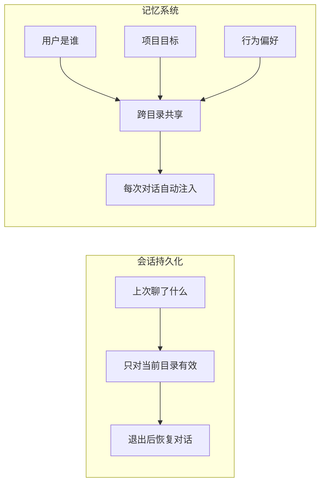
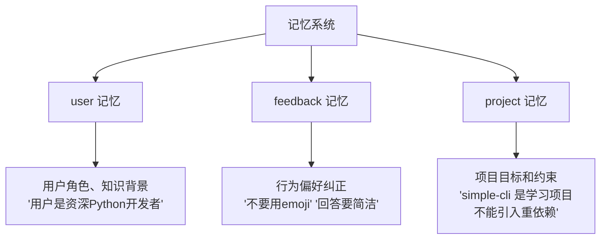
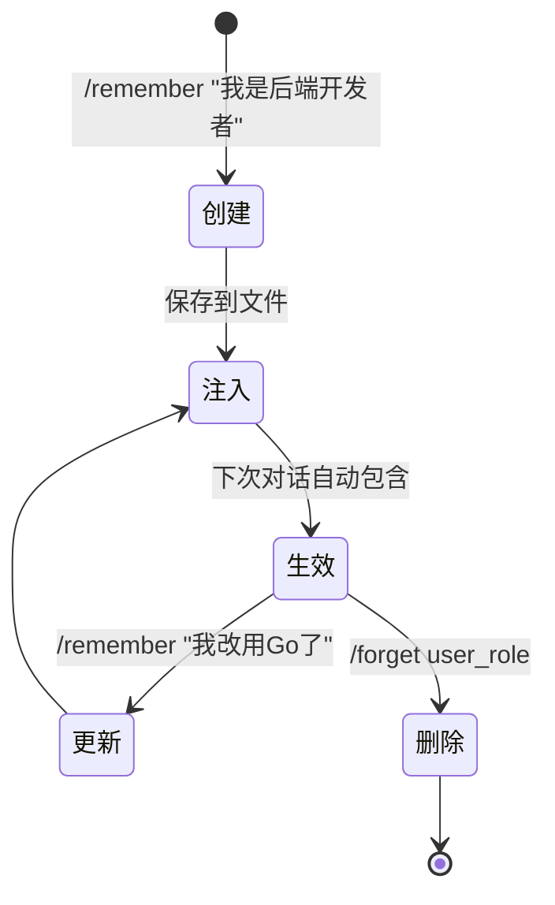

# T2-⑤: 记忆系统 — 跨会话持久化记忆

## 学习目标

区分"会话持久化"和"记忆系统"：前者记住你说过什么，后者记住你是谁、喜欢什么、项目在做什么。

---

## 一、会话持久化 vs 记忆系统



| 维度 | 会话持久化 | 记忆系统 |
|------|-----------|----------|
| 记住什么 | 对话历史 | 用户知识、偏好、项目上下文 |
| 作用范围 | 当前目录 | 全局（跨目录） |
| 数据量 | 大（完整对话） | 小（关键信息摘要） |
| 注入方式 | messages 中的 history | system prompt 的一部分 |

## 二、三类记忆



## 三、存储结构

```
~/.simple_cli/memory/
├── MEMORY.md              # 索引文件（自动加载到上下文）
├── user_role.md            # 用户角色
├── feedback_style.md       # 行为偏好
└── project_context.md      # 项目上下文
```

每个记忆文件格式：
```markdown
---
name: user_role
description: 用户的角色和知识背景
type: user
---

用户是一名 10 年经验的 Python 开发者...
```

## 四、生命周期



## 五、与 Claude Code 对比

| 维度 | Claude Code | simple-cli |
|------|------------|------------|
| 记忆类型 | user/feedback/project/reference | user/feedback/project |
| 存储格式 | Markdown + YAML frontmatter | 同格式 |
| 自动加载 | 每次对话前加载 MEMORY.md | 同 |
| 索引 | MEMORY.md（200行限制） | 同 |
| 命令 | /remember, /forget | 即将新增 |
