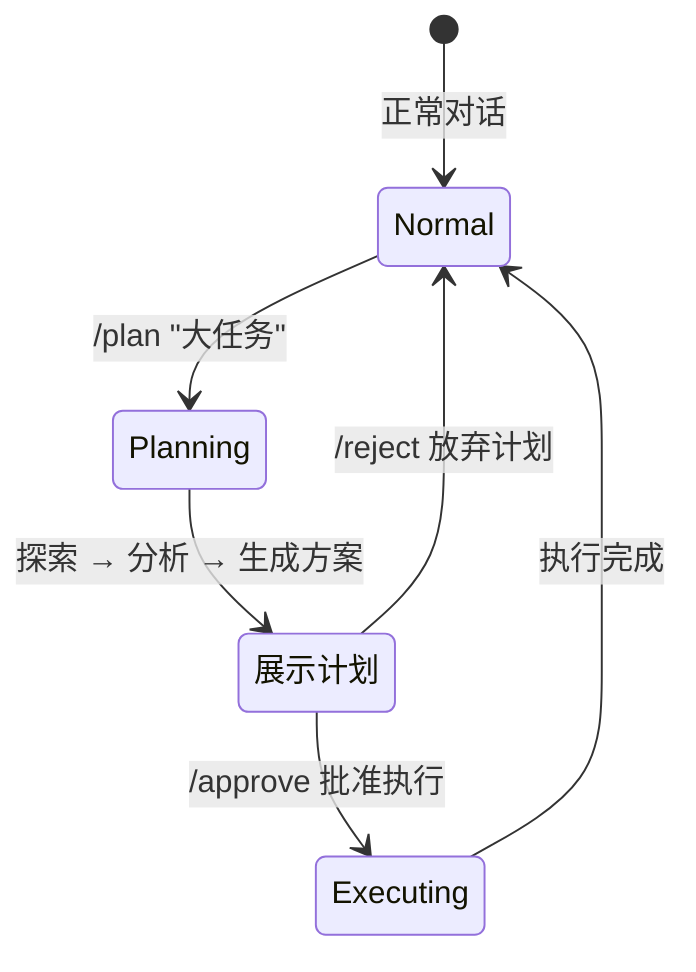
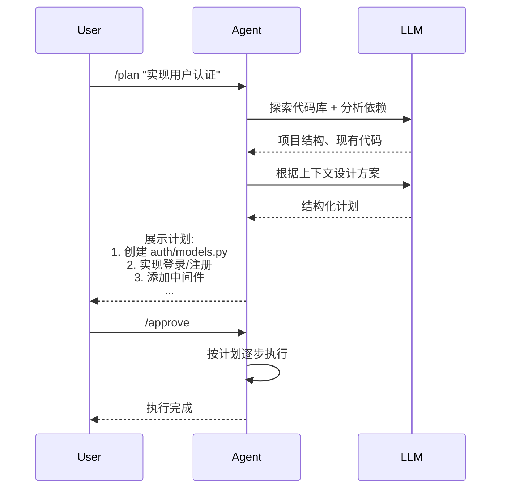

# T2-⑥: 计划模式 — 规划→审批→执行

## 学习目标

理解工作流模板模式：大任务前先规划后执行，避免盲目行动导致返工。

---

## 一、问题：Agent 容易"埋头就干"

```
用户: "帮我实现一个用户认证系统"

Agent（无计划模式）:
  直接就写 auth.py → 写到一半发现需要先改数据库 → 推到重来
  → 浪费 10 轮对话

Agent（有计划模式）:
  先探索代码库 → 分析依赖 → 生成计划 → 用户审批 → 逐步执行
  → 每一步都有方向
```

## 二、计划模式状态机



## 三、命令

| 命令 | 功能 |
|------|------|
| `/plan <任务>` | 进入计划模式，Agent 探索并生成方案 |
| `/approve` | 批准当前计划，进入执行阶段 |
| `/reject` | 拒绝计划，回到正常模式 |

## 四、与时序图


