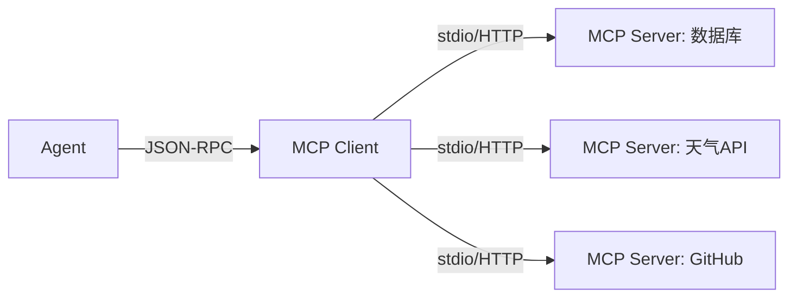
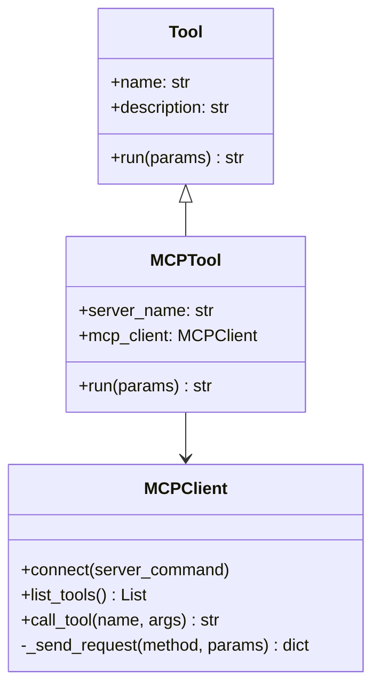
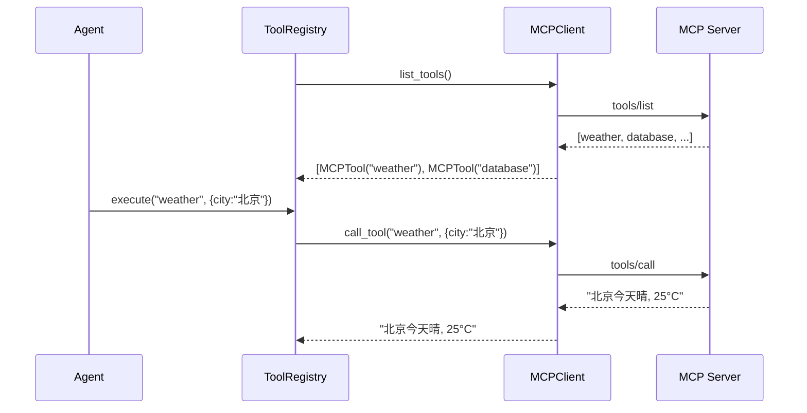

# T3-⑦: MCP 协议 — 标准化外部工具连接

## 学习目标

理解 Model Context Protocol (MCP) 的核心原理：如何通过标准化协议让 Agent 连接任何外部工具服务器。

---

## 一、问题：工具写死在代码里

当前 simple-cli 的工具是 Python 类写死在 `tools/builtin/` 中。要加一个"数据库查询"工具，必须写 Python 代码、注册、重启。

MCP 的思路：工具服务器独立运行，Agent 通过标准化协议动态发现和调用。



## 二、MCP 协议栈

```
应用层:   tools/list, tools/call
传输层:   JSON-RPC 2.0
通信层:   stdio (子进程) 或 HTTP (streamable)
```

## 三、两个核心方法

### tools/list — 发现工具

```
请求: {"method": "tools/list", "id": 1}
响应: {"tools": [{"name": "weather", "description": "查询天气",
        "inputSchema": {"properties": {"city": {"type": "string"}}}}]}
```

### tools/call — 执行工具

```
请求: {"method": "tools/call", "params": {"name": "weather", "arguments": {"city": "北京"}}, "id": 2}
响应: {"content": [{"type": "text", "text": "北京今天晴, 25°C"}]}
```

## 四、MCPTool — 桥接 MCP 和 simple-cli



## 五、与现有工具系统的集成

MCP 工具通过 `MCPClient` 桥接到 `ToolRegistry`，对 Agent 透明——Agent 不区分工具是内置的还是 MCP 的。


