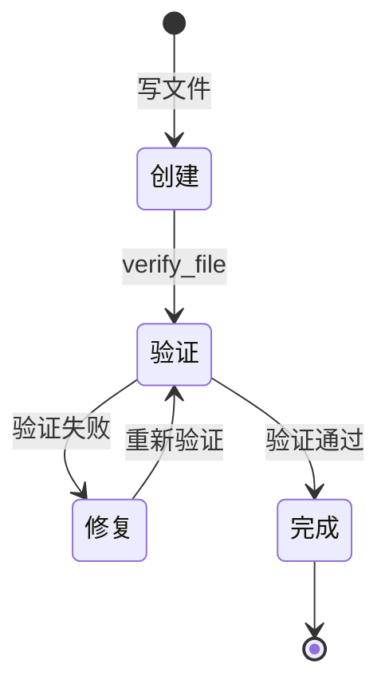

# 验证回环 — Agent 自验证修复能力

## 学习目标

理解"创建→验证→修复"闭环：Agent 不能只写代码不管对错，必须自己验证、发现错误、自动修复。这是从"会写"到"可靠"的关键一步。

## 一、问题：会写不会验

```
当前流程:
  写代码 → 告诉用户"完成了" → 用户打开 → 报错/不能玩 → 用户回来告诉 Agent

理想流程:
  写代码 → 自己验证 → 发现错误 → 自动修复 → 再验证 → 通过 → 告诉用户"已完成并验证"
```

## 二、验证回环状态机



## 三、verify_file 工具

```
输入: 文件路径
输出: 验证结果

验证策略（按文件类型）:
  .py   → py_compile 语法检查
  .html → 结构检查 (html/head/body 标签)
  .js   → node --check (如果可用)
  其他   → 存在性 + 非空检查
```

## 四、集成方式

1. 系统提示加入:"创建文件后必须用 verify_file 验证，验证失败必须修复"
2. PromptBuilder 工具列表自动包含 verify_file
3. Agent 自然形成 创建→验证→修复 循环

这个能力让 Agent 从"写完交差"变成"写完验过才交差"。
