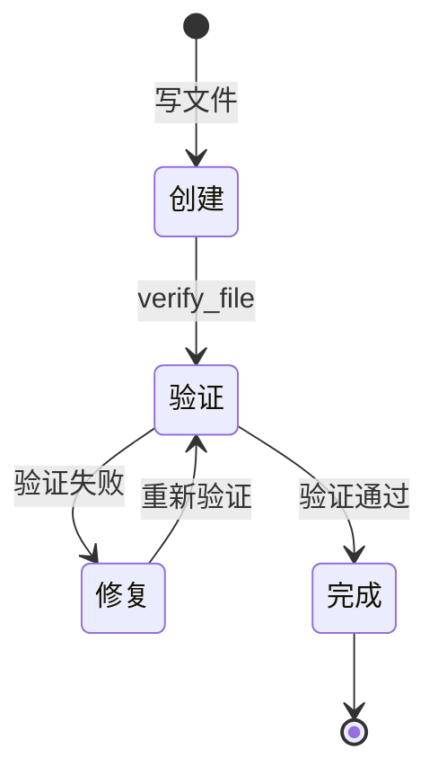

# 验证回环 — Agent 自验证修复能力

## 学习目标

理解"创建→验证→修复"闭环：Agent 不能只写代码不管对错，必须自己验证、发现错误、自动修复。这是从"会写"到"可靠"的关键一步。

## 一、问题：会写不会验

```
当前流程:
  写代码 → 告诉用户"完成了" → 用户打开 → 报错/不能玩 → 用户回来告诉 Agent

理想流程:
  写代码 → 自己验证 → 发现错误 → 自动修复 → 再验证 → 通过 → 告诉用户"已完成并验证"
```

## 二、验证回环状态机



## 三、verify_file 工具

```
输入: 文件路径
输出: 验证结果

验证策略（按文件类型）:
  .py   → py_compile 语法检查
  .html → 结构检查 (html/head/body 标签)
  .js   → node --check (如果可用)
  其他   → 存在性 + 非空检查
```

## 四、集成方式

1. 系统提示加入: "创建或修改任何代码文件后，必须调用 verify_file 验证。验证失败必须根据错误信息修复，然后再次验证。验证通过后才能告诉用户'已完成'。"
2. PromptBuilder 动态注入系统提示，Agent 自动遵守验证规则
3. Agent 自然形成 创建→验证→修复 循环

## 五、实际运行示例

```
> 帮我写一个贪吃蛇HTML游戏

Step 1: write_file[path=snake.html, content=<!DOCTYPE html>...]
  → 成功写入 11390 字符

Step 2: verify_file[path=snake.html]
  → 验证失败: 缺少 <body> 标签，<script> 未正确闭合

Step 3: read_file[path=snake.html]  (检查内容)
  → 定位到具体问题行

Step 4: write_file[path=snake.html, content=...]  (修复后重新写入)

Step 5: verify_file[path=snake.html]
  → 验证通过: HTML 结构正确
  → 告诉用户"已完成并验证通过"
```

## 六、总结

这个能力让 Agent 从"写完交差"变成"写完验过才交差"——就像 TDD 的 red-green-refactor 循环，验证是 Agent 可靠性的最后一道防线。
