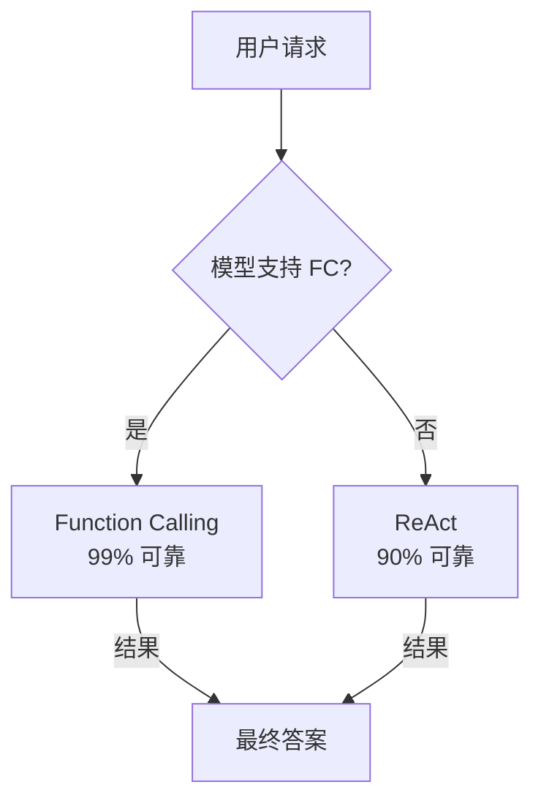
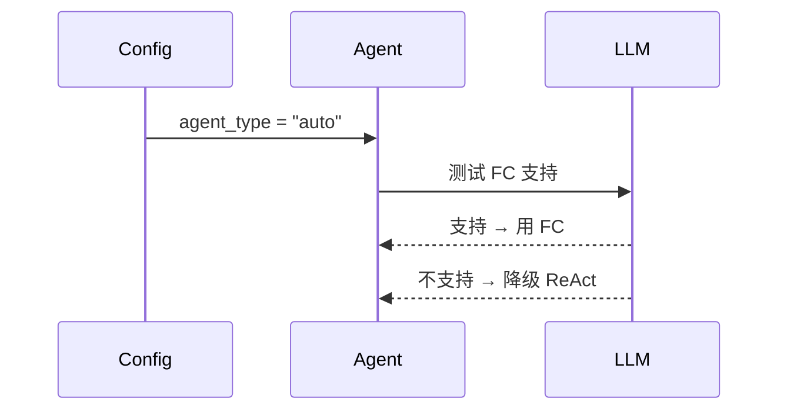

# ReAct 范式优化 — Prompt 改进 + 自动检测 + 工业对比

## 学习目标

理解 ReAct 的本质限制和优化方向：不是"修好"文本解析，而是承认它的局限，在正确场景用正确的工具。

---

## 一、ReAct 的本质定位

**ReAct 不是和 FC 竞争的方案，它是 FC 不存在时的降级方案。**

Claude Code / OpenAI Codex 从不使用文本解析——因为它们只使用自家模型，必然支持 `tools` 参数。ReAct 只为兼容那些不支持 `tools` 的模型（Ollama 本地模型、旧模型等）。

## 二、三项优化

### ① Prompt 模板优化

**旧版问题：**
- 没说清楚分隔符是 `:` 还是 `=`
- 没说参数值里能不能有特殊字符
- 多参数时的分隔符不明确

**新版改进：**
- 明确要求用 `=` 连接参数名和值
- 多参数用 `, ` 分隔
- 参数值用 `"..."` 包裹（处理含空格/逗号的值）
- 工具名必须与可用工具列表完全一致

### ② 自动 FC 检测

`agent_type = "auto"` 时自动检测模型是否支持 `tools` 参数。检测方式：发一个最小 FC 请求（`tools=[{name:"ping"}]`），看 API 是否接受。

### ③ 参数解析鲁棒性增强

当前已包含（在之前的迭代中修复）：
- `=` 和 `:` 双分隔符支持
- 参数名锚点定位（不依赖逗号分割）
- 智能引号剥离（只去外层包裹的引号）
- `param=` 前缀自动剥除
- 连续解析失败 5 次 → 终止

## 三、与 Claude/OpenAI 的对比

| | ReAct（我们） | Function Calling | Claude Tool Use | OpenAI Tool Use |
|---|-------------|-----------------|-----------------|-----------------|
| 可靠性 | ~90% | ~99% | ~99% | ~99% |
| 并行工具 | 不支持 | 支持 | 支持 | 支持 |
| 参数类型 | 全是字符串 | JSON Schema 类型 | JSON Schema 类型 | JSON Schema 类型 |
| 标准 | 无（Prompt 工程） | OpenAI API | Anthropic API | OpenAI API |
| 用途 | 兼容旧模型 | 主力方案 | 主力方案 | 主力方案 |

**关键理解：** ReAct 做了这么多优化（锚点定位、双分隔符、引号剥离...），不是因为文本解析做得好，恰恰是因为文本解析**天生不可靠**——同样的复杂度，FC 一行代码 `response.tool_calls[0].name` 就搞定了。
